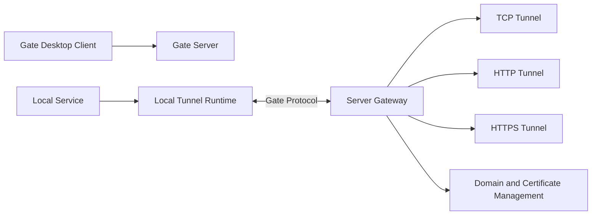

# Architecture

The canonical Gate architecture documentation for v0.9 lives in:

- [Development Architecture](docs/development/architecture.md)
- [Runtime Internals](docs/internals/runtime.md)
- [Communication Internals](docs/internals/communication.md)
- [Monitoring Internals](docs/internals/monitoring.md)
- [Protocol Internals](docs/internals/protocol.md)

This root file is kept as a stable entry point for contributors and external links.

## High-level view

## Release boundary

The v0.9 release cleanup updates documentation, release configuration, packaging configuration, versions, and resources only. It does not modify tunnel data-plane behavior, TCP/HTTP/HTTPS runtime logic, communication protocol behavior, database structure, or business logic.
