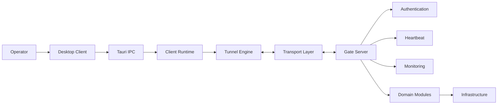
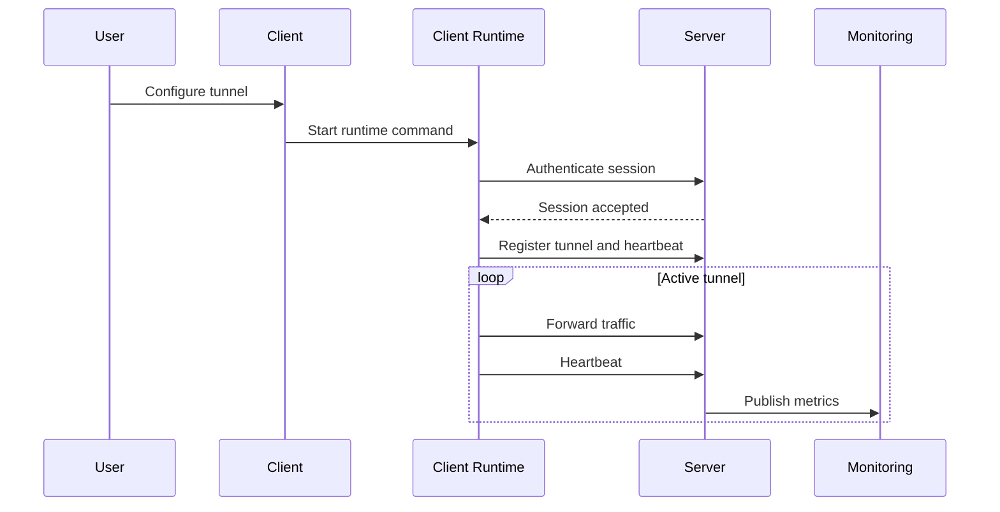

# Gate Architecture

Gate is organized as a layered Rust workspace with a Tauri desktop client and an Axum/Tokio server.
The repository keeps product code, runtime code, documentation, examples, release automation, and
community governance in separate top-level areas.

## Repository Structure

```mermaid
flowchart TD
  Root["Gate Repository"] --> Github[".github<br/>workflows, templates, discussion forms"]
  Root --> Docs["docs<br/>operator and developer documentation"]
  Root --> Website["website<br/>VitePress documentation site"]
  Root --> Examples["examples<br/>runnable scenario templates"]
  Root --> Scripts["scripts<br/>ci, dev, docker, release helpers"]
  Root --> Docker["docker<br/>Dockerfile and Compose"]
  Root --> Assets["assets<br/>static assets"]
  Root --> Branding["branding<br/>brand usage guide"]
  Root --> Benchmark["benchmark<br/>performance templates"]
  Root --> Community["community<br/>policies and workflows"]
  Root --> Templates["templates<br/>GitHub project templates"]
  Root --> Design["design<br/>design system and diagrams"]
  Root --> Client["client<br/>Tauri + Vue desktop app"]
  Root --> Server["server<br/>Axum + Tokio server"]
  Root --> Crates["crates<br/>domain, application, engine, protocol, communication, transport"]
  Root --> Integration["integration<br/>workspace integration tests"]
```

## Runtime View

## Layering Rules

| Layer | Responsibility | Rule |
| --- | --- | --- |
| `crates/domain` | Entities, domain services, repository traits | No framework coupling |
| `crates/application` | Commands, queries, use cases | Depends on domain contracts |
| `crates/infrastructure` | Storage, cache, network, logging adapters | Implements application/domain contracts |
| `crates/protocol` | Packets, frames, codecs, versions | Stable wire compatibility |
| `crates/communication` | Client/server communication orchestration | Uses protocol and transport abstractions |
| `crates/transport` | TCP, HTTP, WebSocket, IPC transports | No product workflow logic |
| `crates/engine` | Runtime, sessions, forwarding, heartbeat, monitoring | Coordinates tunnel lifecycle |
| `server` | Deployable server binary | Thin bootstrap around workspace crates |
| `client` | Desktop client and Tauri commands | UI, IPC, local runtime integration |

## Operational Flow

## Documentation Flow

Architecture decisions should be captured in `docs/ADR`. Public operator-facing docs should live in
root `docs/*.md` and be mirrored into the VitePress navigation in `website/.vitepress/config.ts`.
