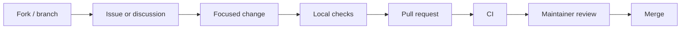

# Contributing to Gate

Thank you for helping make Gate a healthier open source project. Contributions are welcome across
documentation, tests, examples, CI, security hardening, packaging, and runtime code.

## Before You Start

- Search existing issues and discussions.
- Open an issue or discussion for non-trivial changes.
- Keep pull requests focused and reviewable.
- Do not include secrets, private endpoints, production tokens, or customer data.

## Development Setup

```bash
git clone https://github.com/Somirk134/Gate.git
cd gate

cargo test --workspace

cd client
npm install
npm run typecheck
```

## Contribution Flow



## Pull Request Checklist

- The change has a clear description and linked issue when applicable.
- Tests, docs, or examples were updated for behavior changes.
- `cargo fmt --all --check` passes.
- `cargo clippy --workspace --all-targets --all-features -- -D warnings` passes.
- `cargo test --workspace --all-features` passes.
- Client changes pass `npm run typecheck` and `npm run lint` from `client`.
- Documentation changes pass Markdown lint and spell check where possible.

## Commit Style

Use concise, imperative commits:

```text
docs: add deployment troubleshooting guide
ci: split rust and documentation checks
fix: handle closed heartbeat sessions
```

## Review Expectations

Maintainers prioritize correctness, security, compatibility, and operational clarity. Large changes
may be asked to split into design, implementation, tests, and documentation pull requests.

## Community Standards

All participation is governed by [CODE_OF_CONDUCT.md](./CODE_OF_CONDUCT.md). For security issues,
use [SECURITY.md](./SECURITY.md) instead of public issues.
