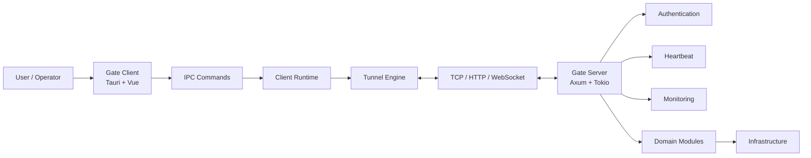

<p align="center">
  <a href="https://github.com/lancemorii-git/gate">
    
  </a>
</p>

<h1 align="center">Gate</h1>

<p align="center">
  Enterprise-grade, self-hosted tunnel runtime for teams that need reliable private service access.
</p>

<p align="center">
  
</p>

<p align="center">
  <a href="./README.zh-CN.md">简体中文</a>
  ·
  <a href="./docs/README.md">Documentation</a>
  ·
  <a href="./CONTRIBUTING.md">Contributing</a>
  ·
  <a href="./SECURITY.md">Security</a>
  ·
  <a href="./ROADMAP.md">Roadmap</a>
</p>

<p align="center">
  <a href="https://www.rust-lang.org"></a>
  <a href="./LICENSE"></a>
  <a href="https://github.com/lancemorii-git/gate/releases"></a>
  <a href="https://github.com/lancemorii-git/gate/actions/workflows/ci.yml"></a>
  <a href="https://github.com/lancemorii-git/gate/actions/workflows/ci.yml"></a>
  
  
  
  <a href="https://github.com/lancemorii-git/gate/stargazers"></a>
  <a href="https://github.com/lancemorii-git/gate/issues"></a>
  <a href="https://github.com/lancemorii-git/gate/pulls"></a>
</p>

## Overview

Gate is a Rust-first tunnel platform with a desktop client, server runtime, authentication,
heartbeat, monitoring, integration tests, and packaging foundations. This repository is now
organized as an enterprise-grade open source project: clear documentation, repeatable CI,
community workflows, release automation, security policy, benchmark templates, and brand assets.

Gate is designed for teams that want self-hosted private access without turning every deployment
into a custom operations project.

## Quick Start

```bash
git clone https://github.com/lancemorii-git/gate.git
cd gate

cargo test --workspace
cargo run -p gate-server
```

Run the desktop client in another terminal:

```bash
cd client
npm install
npm run tauri dev
```

## Features

- Rust workspace with separated domain, application, infrastructure, protocol, communication, transport, server, and desktop runtime layers.
- Tauri desktop client with Vue, TypeScript, IPC commands, monitoring views, and packaging hooks.
- Self-hosted server runtime with authentication, heartbeat, monitoring, and integration coverage.
- Docker, release, documentation, benchmark, security, and community templates prepared for public GitHub maintenance.
- International documentation structure for English and Simplified Chinese.

## Architecture



See [ARCHITECTURE.md](./ARCHITECTURE.md) and [docs/architecture.md](./docs/architecture.md) for deeper diagrams.

## Screenshot

The public screenshot surface is reserved until the product UI is ready for release.


## Installation

| Target | Command |
| --- | --- |
| Server from source | `cargo install --path server` |
| Workspace build | `cargo build --workspace --release` |
| Desktop dev mode | `cd client && npm install && npm run tauri dev` |
| Documentation site | `cd website && npm install && npm run dev` |

Detailed instructions are available in [docs/install.md](./docs/install.md).

## Quick Deploy

```bash
docker compose -f docker/docker-compose.yml up -d
```

This starts the server with the default development profile. Production deployments should review
[docs/deployment.md](./docs/deployment.md), [docs/docker.md](./docs/docker.md), and [SECURITY.md](./SECURITY.md).

## Docker

```bash
docker build -f docker/Dockerfile.server -t gate-server:local .
docker run --rm -p 5800:5800 gate-server:local
```

## Configuration

Gate uses environment-first configuration for deployable services and file-backed configuration for
local desktop state.

```bash
GATE_ENV=production
GATE_BIND=0.0.0.0:5800
GATE_LOG=info
GATE_DATA_DIR=/var/lib/gate
```

See [docs/configuration.md](./docs/configuration.md) for the full template.

## Documentation

| Topic | Link |
| --- | --- |
| Quick Start | [docs/quick-start.md](./docs/quick-start.md) |
| Install | [docs/install.md](./docs/install.md) |
| Configuration | [docs/configuration.md](./docs/configuration.md) |
| Tunnel | [docs/tunnel.md](./docs/tunnel.md) |
| Project | [docs/project.md](./docs/project.md) |
| Authentication | [docs/authentication.md](./docs/authentication.md) |
| Heartbeat | [docs/heartbeat.md](./docs/heartbeat.md) |
| Monitoring | [docs/monitoring.md](./docs/monitoring.md) |
| Deployment | [docs/deployment.md](./docs/deployment.md) |
| Docker | [docs/docker.md](./docs/docker.md) |
| Troubleshooting | [docs/troubleshooting.md](./docs/troubleshooting.md) |
| Development Guide | [docs/development-guide.md](./docs/development-guide.md) |
| Plugin Guide | [docs/plugin-guide.md](./docs/plugin-guide.md) |
| API | [docs/api.md](./docs/api.md) |

The VitePress site lives in [website](./website).

## FAQ

**Is Gate production-ready?**  
Gate is pre-1.0. Use it in controlled environments until the v1 stability criteria are complete.

**Can Gate be self-hosted?**  
Yes. Self-hosting is a primary design goal.

**Does Gate require Docker?**  
No. Docker is optional; source builds and native packages are supported.

**Is a plugin system available?**  
The plugin guide is reserved. Public APIs and compatibility rules will be introduced before v1.5.

## Roadmap

The roadmap is maintained in [ROADMAP.md](./ROADMAP.md) using GitHub Project-style columns:
Todo, In Progress, Review, Done, Roadmap, and Milestone.

## Contributing

Contributions are welcome after opening an issue or discussion for non-trivial changes. Start with
[CONTRIBUTING.md](./CONTRIBUTING.md), [community/contribution-workflow.md](./community/contribution-workflow.md),
and the pull request template.

## License

Gate is licensed under the [MIT License](./LICENSE). Apache-2.0 and dual-license options are reserved
for future governance review.

## Sponsor

Sponsorship channels are reserved in [SPONSORS.md](./SPONSORS.md) and [.github/FUNDING.yml](./.github/FUNDING.yml).

## Star History

Star history is reserved for the public GitHub launch.

```text
https://star-history.com/#lancemorii-git/gate&Date
```
