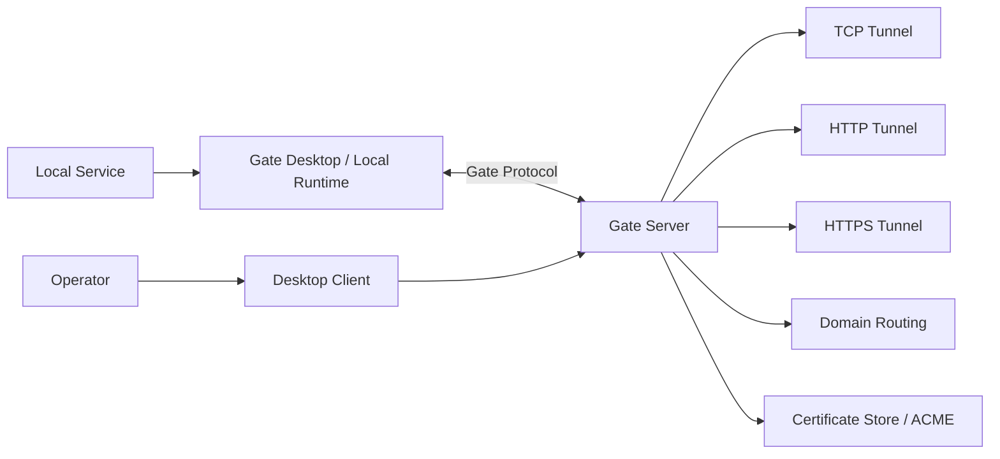

<p align="center">
  
</p>

<h1 align="center">Gate</h1>

<p align="center">
  A self-hosted tunnel platform with TCP, HTTP, HTTPS, domain, certificate, and desktop management workflows.
</p>

<p align="center">
  <a href="README.zh-CN.md">中文</a> ·
  <a href="docs/README.md">Documentation</a> ·
  <a href="CONTRIBUTING.md">Contributing</a> ·
  <a href="SECURITY.md">Security</a>
</p>

---

## What is Gate?

Gate is an open-source, self-hosted tunneling project for exposing local services through your own server infrastructure. It combines a Rust server, a Tauri desktop client, and a modular protocol/runtime workspace so teams can manage tunnels without depending on a hosted SaaS control plane.

Gate v0.9 focuses on a mature open-source release foundation: clean documentation, reproducible builds, desktop packaging, Docker deployment, and release automation.

## Core capabilities

- **TCP Tunnel**: expose local TCP services through a Gate server.
- **HTTP Tunnel**: route HTTP services for webhooks, local apps, and QA environments.
- **HTTPS Tunnel**: support HTTPS-oriented workflows and certificate-aware deployment.
- **Domain Management**: organize server-side domain routing metadata.
- **Certificate Management**: manage certificate storage and ACME-oriented workflows.
- **Desktop Client**: configure servers, projects, tunnels, diagnostics, logs, and settings from a Tauri desktop UI.
- **Docker Deployment**: run the server with the provided Dockerfile and Compose templates.
- **Release Engineering**: build server binaries and desktop installers from GitHub Actions tags.

## Screenshots

<p align="center">
  
</p>

| Dashboard | Tunnel Management | Logs |
| --- | --- | --- |
|  |  |  |

## Architecture



## Quick Start — Deploy with Docker (Recommended)

This is the fastest way to get Gate running on a Linux server. No source code or build tools required.

### 1. Pull the image

```bash
docker pull qwe1235/gate-server:0.9.0
```

Or use `latest` tag:

```bash
docker pull qwe1235/gate-server:latest
```

### 2. Generate an auth token

The token is used by desktop clients to authenticate with your Gate server. **Pick a long random string** — do not use the example below in production.

```bash
# Example: generate a random token
openssl rand -hex 32
# Output: a1b2c3d4e5f6... (save this value)
```

### 3. Run with Docker Compose

Create a `docker-compose.yml` file (or use [docker/docker-compose.release.yml](docker/docker-compose.release.yml) from this repo):

```yaml
services:
  gate-server:
    image: qwe1235/gate-server:0.9.0
    network_mode: host
    restart: unless-stopped
    environment:
      GATE_ENV: production
      GATE_SERVER_ADDR: "0.0.0.0:${GATE_PORT:-5800}"
      GATE_AUTH_TOKEN: ${GATE_AUTH_TOKEN:?Set your token}
      GATE_TUNNEL_BIND_ADDR: 0.0.0.0
      GATE_LOG: info
      GATE_DATA_DIR: /var/lib/gate
      GATE_CONFIG: /etc/gate/gate.toml
      GATE_CERT_DIR: /var/lib/gate/certificates
    volumes:
      - gate-data:/var/lib/gate
      - gate-config:/etc/gate
      - gate-logs:/var/log/gate
    healthcheck:
      test: ["CMD", "gate-server", "--healthcheck"]
      interval: 30s
      timeout: 5s
      retries: 3
      start_period: 10s

volumes:
  gate-data:
  gate-config:
  gate-logs:
```

Start the server:

```bash
GATE_AUTH_TOKEN=your-token-here docker compose up -d
```

> **One-line alternative** using the repo's release template directly:
> ```bash
> GATE_AUTH_TOKEN=your-token-here \
>   docker compose -f https://raw.githubusercontent.com/Somirk134/Gate/main/docker/docker-compose.release.yml up -d
> ```

### 4. Open ports on your server

| Port | Purpose | Required |
|------|---------|----------|
| `5800/tcp` | Desktop client ↔ Server communication | Always |
| Any `remotePort` you assign | Public access to tunneled services | Per-tunnel |

Open these in your cloud security group (AWS Security Group, Alibaba Cloud, etc.) or host firewall (`ufw`, `firewalld`).

Example for Linux `ufw`:

```bash
ufw allow 5800/tcp comment "Gate control port"
# When you create a tunnel using remotePort 18080:
ufw allow 18080/tcp comment "Gate tunnel"
```

### 5. Verify the server is running

```bash
docker compose ps        # Check container status
docker compose logs -f   # View real-time logs
```

You should see the Gate server listening on port `5800`.

---

## How to Use — Complete Guide

### Step A: Install the Desktop Client

Download the latest installer from **GitHub Releases**:

| Platform | File |
|----------|------|
| Windows | `.exe` installer (NSIS) |
| macOS Intel | `.dmg` |
| macOS Apple Silicon | `.dmg` |
| Linux | `.AppImage` or `.deb` |

Go to the [Releases](https://github.com/Somirk134/Gate/releases) page → download the package for your OS → install it.

> If no release is available yet, build locally:
> ```bash
> git clone https://github.com/Somirk134/Gate.git && cd Gate
> npm --prefix client ci
> npm --prefix client run tauri build
> ```
> Find installers in `client/src-tauri/target/release/bundle/`.

### Step B: Connect to Your Gate Server

1. **Launch** the Gate desktop application.
2. **Add a server**: Enter your server's public IP or domain and port `5800`.
   - Example: `203.0.113.50:5800` or `gate.example.com:5800`
3. **Enter the auth token**: Use the same `GATE_AUTH_TOKEN` you set when starting the container.
4. **Save** — the client will connect to your server.

You should see a green "connected" status on the dashboard.

### Step C: Create Your First TCP Tunnel

Let's expose a local web app running on `127.0.0.1:3000` to the public internet.

**Before you begin**, make sure:
- ✅ Gate server is running (Step 3 above)
- ✅ Desktop client is connected (Step B)
- ✅ Your local service is actually listening (e.g., `python -m http.server 3000`)

**In the desktop client:**

1. Go to **Tunnel Management** panel.
2. Click **Create Tunnel**.
3. Fill in the fields:

   | Field | Value (example) | Description |
   |-------|----------------|-------------|
   | Name | `my-web-app` | Friendly name for this tunnel |
   | Type | `TCP` | Protocol type |
   | Local Address | `127.0.0.1:3000` | Your local service address |
   | Remote Port | `18080` | Port on Gate server that forwards traffic |

4. Click **Create**.
5. Toggle the tunnel switch to **Start**.
6. Open the remote port on your server firewall if not already open:
   ```bash
   ufw allow 18080/tcp
   ```

### Step D: Verify It Works

From any machine on a different network (your laptop, another server, etc.):

```bash
curl http://YOUR_SERVER_IP:18080
# Or open http://YOUR_SERVER_IP:18080 in a browser
```

If you see the response from your local service — congratulations, your first tunnel is working! 🎉

Check the **Dashboard** and **Log Center** in the desktop client to monitor traffic and connection status.

---

## Common Operations

### Manage the server container

```bash
# Stop the server
docker compose down

# Restart the server
docker compose restart

# View real-time logs
docker compose logs -f --tail=100

# Update to a new image version
docker pull qwe1235/gate-server:0.9.0
docker compose up -d
```

### Create more tunnels

Repeat **Step C** for each local service. Each tunnel gets its own `remotePort`. Remember to open each new port on your firewall/security group.

### HTTP / HTTPS Tunnels

Gate also supports HTTP and HTTPS tunnel types. In the **Create Tunnel** dialog:
- Select type **HTTP** for web services — Gate routes HTTP Host headers.
- Select type **HTTPS** for TLS-terminated services — configure certificates via the Certificate Management panel.

---

## Configuration Reference

| Variable | Default | Description |
|----------|---------|-------------|
| `GATE_ENV` | `production` | Environment mode: `development` or `production` |
| `GATE_SERVER_ADDR` | `0.0.0.0:5800` | Listen address for client connections |
| `GATE_AUTH_TOKEN` | `change-me` | **Required.** Auth token for desktop clients |
| `GATE_TUNNEL_BIND_ADDR` | `0.0.0.0` | Bind address for tunnel listeners |
| `GATE_DATA_DIR` | `/var/lib/gate` | Data storage directory |
| `GATE_CONFIG` | `/etc/gate/gate.toml` | Configuration file path |
| `GATE_CERT_DIR` | `/var/lib/gate/certificates` | Certificate storage directory |
| `GATE_LOG` | `info` | Log level: `trace`, `debug`, `info`, `warn`, `error` |
| `GATE_PORT` | `5800` | Control port override (used in Compose templates) |

> ⚠️ **Always set `GATE_AUTH_TOKEN` to a strong random string in production. Never use defaults on a public server.**

---

## Docker Deployment Details

### Bridge network mode (Docker Desktop / Windows / macOS)

If `network_mode: host` is not available (e.g., Docker Desktop), use bridge networking:

```bash
GATE_AUTH_TOKEN=your-token-here \
GATE_PORT=5800 \
GATE_TUNNEL_PORT_RANGE=18080-18100 \
  docker compose -f docker/docker-compose.bridge.yml up -d
```

In bridge mode, tunnel ports must be declared in advance via `GATE_TUNNEL_PORT_RANGE`. Ports outside this range will not be accessible from outside.

### Build from source

```bash
git clone https://github.com/Somirk134/Gate.git && cd Gate
docker build -f docker/Dockerfile.server -t gate-server:local .
```

Then use `image: gate-server:local` in your Compose file instead of pulling from Docker Hub.

See full [Docker documentation](docs/user/docker.md) and [Deployment guide](docs/user/deployment.md).

---

## Run from Source (Development)

For developers who want to modify Gate or contribute code.

### Requirements

- Rust 1.88+
- Node.js 20+
- npm 10+
- Git
- Platform-specific Tauri prerequisites for desktop builds

### Build & run

```bash
git clone https://github.com/Somirk134/Gate.git
cd Gate
npm --prefix client ci
cargo check --workspace
cargo test --workspace
npm run typecheck
npm run build
```

Start the server:

```bash
npm run dev:server
```

Start the desktop client in another terminal:

```bash
npm run dev:desktop
```

Local development defaults:

- Server: `127.0.0.1:7000`
- Token: `gate-alpha-token`

Do not use the development token for shared or public deployments.

## Documentation

- [Getting Started](docs/user/getting-started.md)
- [Installation](docs/user/installation.md)
- [Deployment](docs/user/deployment.md)
- [Configuration](docs/user/configuration.md)
- [Troubleshooting](docs/user/troubleshooting.md)
- [Architecture](docs/development/architecture.md)
- [Release Process](docs/development/release.md)

## Contributing

Contributions are welcome. Please read:

- [CONTRIBUTING.md](CONTRIBUTING.md)
- [Developer documentation](docs/development/contributing.md)
- [Code of Conduct](CODE_OF_CONDUCT.md)
- [Security Policy](SECURITY.md)

Before opening a pull request, run:

```bash
cargo check --workspace
cargo test --workspace
npm run typecheck
npm run build
```

## License

Gate is released under the [MIT License](LICENSE).
