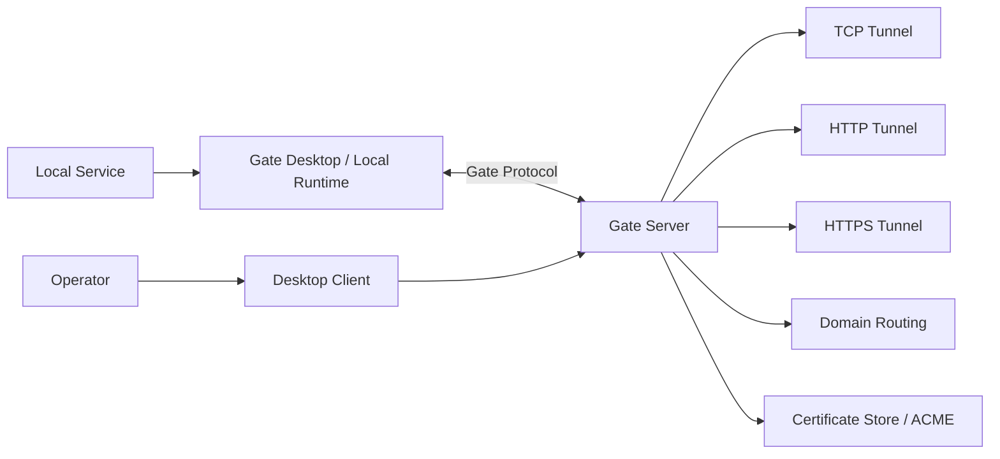

<p align="center">
  
</p>

<h1 align="center">Gate</h1>

<p align="center">
  A self-hosted tunnel platform with TCP, HTTP, HTTPS, domain, certificate, and desktop management workflows.
</p>

<p align="center">
  <a href="README.zh-CN.md">中文</a> ·
  <a href="docs/README.md">Documentation</a> ·
  <a href="CONTRIBUTING.md">Contributing</a> ·
  <a href="SECURITY.md">Security</a>
</p>

---

## What is Gate?

Gate is an open-source, self-hosted tunneling project for exposing local services through your own server infrastructure. It combines a Rust server, a Tauri desktop client, and a modular protocol/runtime workspace so teams can manage tunnels without depending on a hosted SaaS control plane.

Gate v0.9 focuses on a mature open-source release foundation: clean documentation, reproducible builds, desktop packaging, Docker deployment, and release automation.

## Core capabilities

- **TCP Tunnel**: expose local TCP services through a Gate server.
- **HTTP Tunnel**: route HTTP services for webhooks, local apps, and QA environments.
- **HTTPS Tunnel**: support HTTPS-oriented workflows and certificate-aware deployment.
- **Domain Management**: organize server-side domain routing metadata.
- **Certificate Management**: manage certificate storage and ACME-oriented workflows.
- **Desktop Client**: configure servers, projects, tunnels, diagnostics, logs, and settings from a Tauri desktop UI.
- **Docker Deployment**: run the server with the provided Dockerfile and Compose templates.
- **Release Engineering**: build server binaries and desktop installers from GitHub Actions tags.

## Screenshots

<p align="center">
  
</p>

| Dashboard | Tunnel Management | Logs |
| --- | --- | --- |
|  |  |  |

## Architecture



## Quick start

### Requirements

- Rust 1.88+
- Node.js 20+
- npm 10+
- Git
- Platform-specific Tauri prerequisites for desktop builds

### Run from source

```bash
git clone https://github.com/Somirk134/Gate.git
cd Gate
npm --prefix client ci
cargo check --workspace
cargo test --workspace
npm run typecheck
npm run build
```

Start the server:

```bash
npm run dev:server
```

Start the desktop client in another terminal:

```bash
npm run dev:desktop
```

Local development defaults:

- Server: `127.0.0.1:7000`
- Token: `gate-alpha-token`

Do not use the development token for shared or public deployments.

## Docker deployment

Build locally:

```bash
docker build -f docker/Dockerfile.server -t gate-server:local .
```

Run with Docker Compose:

```bash
GATE_AUTH_TOKEN=replace-with-a-long-random-token GATE_PORT=5800 \
docker compose up -d
```

The container listens on `0.0.0.0:5800` by default and exposes `${GATE_PORT:-5800}` on the host.

See [Docker documentation](docs/user/docker.md) and [Deployment documentation](docs/user/deployment.md).

## Desktop client installation

Release builds are prepared for:

- Windows installer
- macOS `.dmg` packages for Intel and Apple Silicon
- Linux `.AppImage` and `.deb` packages

Until a signed update server is available, download desktop installers from GitHub Releases and upgrade manually.

For a local desktop build:

```bash
npm --prefix client ci
npm --prefix client run tauri build
```

## Documentation

- [Getting Started](docs/user/getting-started.md)
- [Installation](docs/user/installation.md)
- [Deployment](docs/user/deployment.md)
- [Configuration](docs/user/configuration.md)
- [Troubleshooting](docs/user/troubleshooting.md)
- [Architecture](docs/development/architecture.md)
- [Release Process](docs/development/release.md)

## Contributing

Contributions are welcome. Please read:

- [CONTRIBUTING.md](CONTRIBUTING.md)
- [Developer documentation](docs/development/contributing.md)
- [Code of Conduct](CODE_OF_CONDUCT.md)
- [Security Policy](SECURITY.md)

Before opening a pull request, run:

```bash
cargo check --workspace
cargo test --workspace
npm run typecheck
npm run build
```

## License

Gate is released under the [MIT License](LICENSE).
