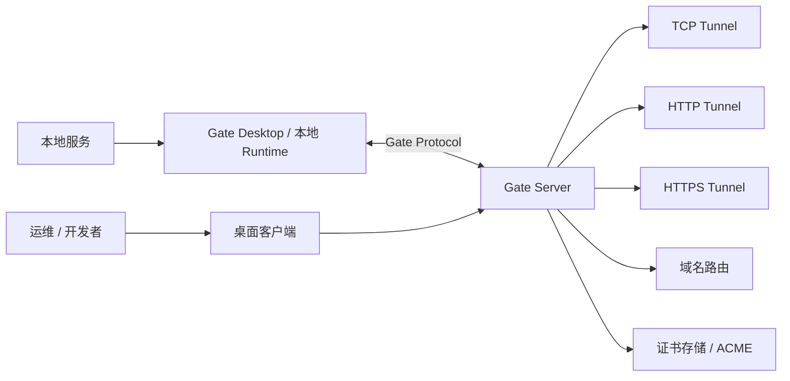

<p align="center">
  
</p>

<h1 align="center">Gate</h1>

<p align="center">
  自托管隧道平台，支持 TCP、HTTP、HTTPS、域名、证书和桌面端管理工作流。
</p>

<p align="center">
  <a href="README.md">English</a> ·
  <a href="docs/README.md">文档</a> ·
  <a href="CONTRIBUTING.md">贡献指南</a> ·
  <a href="SECURITY.md">安全策略</a>
</p>

---

## Gate 是什么？

Gate 是一个开源、自托管的隧道项目，用于通过你自己的服务器基础设施暴露本地服务。它由 Rust 服务端、Tauri 桌面客户端，以及模块化协议和运行时工作区组成，让团队可以在不依赖托管 SaaS 控制平面的情况下管理隧道。

Gate v0.9 聚焦成熟开源发布基础：清晰文档、可复现构建、桌面端打包、Docker 部署和 Release 自动化。

## 核心能力

- **TCP Tunnel**：通过 Gate 服务端暴露本地 TCP 服务。
- **HTTP Tunnel**：为 Webhook、本地应用和 QA 环境路由 HTTP 服务。
- **HTTPS Tunnel**：支持 HTTPS 场景和证书相关部署工作流。
- **Domain 管理**：组织服务端域名路由元数据。
- **Certificate 管理**：管理证书存储和 ACME 相关工作流。
- **Desktop Client**：通过 Tauri 桌面 UI 管理 Server、Project、Tunnel、诊断、日志和设置。
- **Docker 部署**：使用内置 Dockerfile 和 Compose 模板运行服务端。
- **Release 工程化**：通过 GitHub Actions tag 构建服务端二进制和桌面安装包。

## 截图

<p align="center">
  
</p>

| Dashboard | Tunnel 管理 | 日志 |
| --- | --- | --- |
|  |  |  |

## 架构图



## 快速开始 — Docker 部署（推荐）

这是在 Linux 服务器上运行 Gate 最快的方式，无需源码或构建工具。

### 1. 拉取镜像

```bash
docker pull qwe1235/gate-server:0.9.1
```

也可以使用 `latest` 标签：

```bash
docker pull qwe1235/gate-server:latest
```

> 镜像大小仅 **34.4 MB**，拉取非常快。

### 2. 生成认证令牌（Token）

Token 用于桌面客户端连接 Gate 服务端时的身份验证。**务必使用长随机字符串**——生产环境不要用示例值。

```bash
# 示例：生成随机 token
openssl rand -hex 32
# 输出：a1b2c3d4e5f6...（保存这个值）
```

如果没有 `openssl`，可以用任意方式生成长随机字符串（比如 [passwordsgenerator.net](https://passwordsgenerator.net/)）。

### 3. 用 Docker Compose 启动服务

新建一个 `docker-compose.yml` 文件（或直接使用仓库中的 [docker/docker-compose.release.yml](docker/docker-compose.release.yml)）：

```yaml
services:
  gate-server:
    image: qwe1235/gate-server:0.9.1
    network_mode: host
    restart: unless-stopped
    environment:
      GATE_ENV: production
      GATE_SERVER_ADDR: "0.0.0.0:${GATE_PORT:-5800}"
      GATE_AUTH_TOKEN: ${GATE_AUTH_TOKEN:?请设置你的 Token}
      GATE_TUNNEL_BIND_ADDR: 0.0.0.0
      GATE_LOG: info
      GATE_DATA_DIR: /var/lib/gate
      GATE_CONFIG: /etc/gate/gate.toml
      GATE_CERT_DIR: /var/lib/gate/certificates
    volumes:
      - gate-data:/var/lib/gate
      - gate-config:/etc/gate
      - gate-logs:/var/log/gate
    healthcheck:
      test: ["CMD", "gate-server", "--healthcheck"]
      interval: 30s
      timeout: 5s
      retries: 3
      start_period: 10s

volumes:
  gate-data:
  gate-config:
  gate-logs:
```

启动服务端：

```bash
GATE_AUTH_TOKEN=你的token docker compose up -d
```

> **一行命令替代方案**：直接使用仓库的 release 模板：
> ```bash
> GATE_AUTH_TOKEN=你的token \
>   docker compose -f https://raw.githubusercontent.com/Somirk134/Gate/main/docker/docker-compose.release.yml up -d
> ```

### 4. 开放服务器端口

| 端口 | 用途 | 是否必须 |
|------|------|----------|
| `5800/tcp` | 桌面客户端 ↔ 服务端通信 | 始终需要 |
| 你分配的任意 `remotePort` | 公网访问隧道服务 | 每条隧道一个 |

在你的云服务商安全组（阿里云安全组、腾讯云安全组、AWS Security Group 等）或主机防火墙（`ufw`、`firewalld`）中开放这些端口。

Linux `ufw` 示例：

```bash
ufw allow 5800/tcp comment "Gate 控制端口"
# 当你创建了 remotePort 为 18080 的隧道后：
ufw allow 18080/tcp comment "Gate 隧道"
```

### 5. 验证服务端是否正常运行

```bash
docker compose ps        # 查看容器状态
docker compose logs -f   # 查看实时日志
```

你应该能看到 Gate 服务端正在监听端口 `5800`。

---

## 方式二：二进制直跑（免 Docker）

不想用 Docker、或服务器环境不方便跑容器时，可以直接在服务器上运行独立的 `gate-server` 二进制，再在本机装桌面客户端连上来。整套流程分两端：

- **服务端（你的云服务器 / VPS）**：下载 `gate-server` 二进制 → 设置 token 和监听地址 → 启动。
- **客户端（你日常用的电脑）**：下载安装桌面客户端 → 填服务器地址 + token → 连接。

### 1. 服务端：下载并启动 `gate-server`

到 [GitHub Releases v0.9.1](https://github.com/Somirk134/Gate/releases/tag/v0.9.1) 下载对应服务器系统的二进制：

| 服务器系统 | 下载文件 |
|----------|----------|
| Linux x64 | `gate-server-v0.9.1-linux-x64` |
| macOS Apple Silicon | `gate-server-v0.9.1-macos-arm64` |
| macOS Intel | `gate-server-v0.9.1-macos-x64` |
| Windows x64 | `gate-server-v0.9.1-windows-x64.exe` |

以 **Linux 服务器** 为例：

```bash
# 下载二进制
curl -L -o gate-server https://github.com/Somirk134/Gate/releases/download/v0.9.1/gate-server-v0.9.1-linux-x64
chmod +x gate-server

# 生成一个强随机 token 并保存
TOKEN=$(openssl rand -hex 32)

# 启动：监听所有网卡、用你自己的 token
GATE_SERVER_ADDR=0.0.0.0:5800 \
GATE_AUTH_TOKEN=$TOKEN \
./gate-server
```

启动成功后控制台只打印公开连接信息，认证 Token 不会写入标准输出或日志：

```
========================================
  Gate Server started successfully
========================================
  Listen address : 0.0.0.0:5800
  Local IP       : 203.0.113.50
  Access address : 203.0.113.50:5800
  Authentication : configured
========================================
```

> **Windows 用户**：先设置 `GATE_AUTH_TOKEN`，再从终端运行 `gate-server-v0.9.1-windows-x64.exe`。
> **macOS 用户**：`chmod +x gate-server-v0.9.1-macos-*`，设置 `GATE_AUTH_TOKEN` 后再运行二进制。
> `GATE_AUTH_TOKEN` 缺失、少于 16 个字符或使用已知弱默认值时，服务端会拒绝启动。

**进阶：让服务端后台常驻（Linux）**

```bash
# 简单后台运行
nohup env GATE_SERVER_ADDR=0.0.0.0:5800 GATE_AUTH_TOKEN=$TOKEN ./gate-server > gate-server.log 2>&1 &

# 或更稳妥地用 systemd（/etc/systemd/system/gate-server.service）
# [Unit]
# Description=Gate Server
# After=network.target
# [Service]
# Environment=GATE_SERVER_ADDR=0.0.0.0:5800
# Environment=GATE_AUTH_TOKEN=你的token
# ExecStart=/opt/gate-server
# Restart=on-failure
# [Install]
# WantedBy=multi-user.target
```

### 2. 服务端：开放防火墙端口

和 Docker 方式一样，在云安全组 / 主机防火墙开放 `5800/tcp`（后续每条隧道还要开放对应的 `remotePort`）：

```bash
ufw allow 5800/tcp comment "Gate 控制端口"
```

### 3. 客户端：安装并连接

转到 [使用指南 — 从零到跑通](#使用指南--从零到跑通) 的 **第一步 / 第二步**：

1. 在本机下载并安装对应系统的客户端安装包（`.exe` / `.dmg` / `.AppImage` / `.deb`）。
2. 打开客户端 → 添加服务器 → 填 `服务器公网IP:5800` + 刚才的 token → 保存连接。

看到绿色「已连接」即成功。之后创建隧道、验证公网访问，流程与 Docker 方式完全一致（见 **第三步 / 第四步**）。

---

## 使用指南 — 从零到跑通

### 第一步：安装桌面客户端

从 **GitHub Releases** 下载对应平台的安装包：

| 平台 | 安装包 |
|------|--------|
| Windows | `.exe` 安装包（NSIS 格式） |
| macOS Intel | `.dmg` |
| macOS Apple Silicon (M1/M2/M3) | `.dmg` |
| Linux | `.AppImage` 或 `.deb` |

前往 [Releases 页面](https://github.com/Somirk134/Gate/releases) → 下载你系统对应的安装包 → 安装即可。

> 如果还没有发布 Release 包，可以本地构建：
> ```bash
> git clone https://github.com/Somirk134/Gate.git && cd Gate
> npm --prefix client ci
> npm --prefix client run tauri build
> ```
> 构建产物在 `client/src-tauri/target/release/bundle/` 目录下。

### 第二步：连接 Gate 服务端

1. **打开** Gate 桌面客户端。
2. **添加服务器**：输入服务器的公网 IP 或域名 + 端口 `5800`。
   - 例如：`203.0.113.50:5800` 或 `gate.example.com:5800`
3. **输入认证令牌**：填写第 2 步设置的 `GATE_AUTH_TOKEN` 值。
4. **保存**——客户端会自动连接到你的服务端。

Dashboard 上应该能看到绿色的「已连接」状态。

### 第三步：创建第一条 TCP 隧道

假设你要把本机运行在 `127.0.0.1:3000` 的 Web 应用通过 Gate 服务端暴露到公网。

**开始之前，确认以下条件已满足：**
- ✅ 服务端正在运行（上面的第 3 步）
- ✅ 桌面客户端已连接到服务端（第二步）
- ✅ 本地要暴露的服务确实在监听（比如先跑起来 `python -m http.server 3000`）

**在桌面客户端中操作：**

1. 进入 **Tunnel 管理** 面板。
2. 点击 **创建隧道**。
3. 填写字段：

   | 字段 | 示例值 | 说明 |
   |------|--------|------|
   | 名称 | `我的Web应用` | 给这条隧道起个名字 |
   | 类型 | `TCP` | 协议类型 |
   | 本地地址 | `127.0.0.1:3000` | 本地服务的地址 |
   | 远程端口 | `18080` | 服务端上用于公网访问的端口 |

4. 点击 **创建**。
5. 打开隧道的开关 → **启动**。
6. 在服务器防火墙上开放该远程端口：
   ```bash
   ufw allow 18080/tcp
   ```

### 第四步：验证隧道是否生效

在任何一台**不在同一内网的设备**上（你的另一台电脑、手机、或者另一台服务器）执行：

```bash
curl http://你的服务器IP:18080
# 或者直接在浏览器打开 http://你的服务器IP:18080
```

如果你看到了本地服务的响应内容 —— 恭喜！🎉 你的第一条隧道已经跑通了！

回到桌面客户端查看 **Dashboard** 和 **日志中心**，可以监控流量和连接状态。

---

## 常用操作

### 管理服务端容器

```bash
# 停止服务
docker compose down

# 重启服务
docker compose restart

# 查看实时日志
docker compose logs -f --tail=100

# 更新到新版本镜像
docker pull qwe1235/gate-server:0.9.1
docker compose up -d
```

### 创建更多隧道

重复**第三步**即可。每条隧道分配独立的 `remotePort`，记得在防火墙/安全组上开放新端口。

### HTTP / HTTPS 隧道

除了 TCP，Gate 还支持 HTTP 和 HTTPS 类型隧道。在**创建隧道**对话框中：
- 选择类型 **HTTP** —— Gate 会根据 HTTP Host 头进行路由。
- 选择类型 **HTTPS** —— 用于 TLS 终止场景，需通过证书管理面板配置证书。

---

## 配置参考

| 变量 | 默认值 | 说明 |
|------|--------|------|
| `GATE_ENV` | `production` | 运行模式：`development` 或 `production` |
| `GATE_SERVER_ADDR` | `0.0.0.0:5800` | 客户端连接监听地址 |
| `GATE_AUTH_TOKEN` | 无 | **必填。** 桌面客户端认证令牌；已知弱默认值会被拒绝 |
| `GATE_TUNNEL_BIND_ADDR` | `0.0.0.0` | 隧道监听绑定地址 |
| `GATE_DATA_DIR` | `/var/lib/gate` | 数据存储目录 |
| `GATE_CONFIG` | `/etc/gate/gate.toml` | 配置文件路径 |
| `GATE_CERT_DIR` | `/var/lib/gate/certificates` | 证书存储目录 |
| `GATE_LOG` | `info` | 日志级别：`trace`/`debug`/`info`/`warn`/`error` |
| `GATE_PORT` | `5800` | 控制端口覆盖值（Compose 模板中使用） |

> ⚠️ **生产环境务必将 `GATE_AUTH_TOKEN` 设置为强随机字符串。公网服务器上绝对不要使用默认值。**

---

## Docker 部署详情

### Bridge 网络模式（Docker Desktop / Windows / macOS）

如果你的环境不支持 `network_mode: host`（例如 Docker Desktop），可以使用 bridge 网络 + 显式端口映射：

```bash
GATE_AUTH_TOKEN=你的token \
GATE_PORT=5800 \
GATE_TUNNEL_PORT_RANGE=18080-18100 \
  docker compose -f docker/docker-compose.bridge.yml up -d
```

Bridge 模式下，隧道端口必须在 `GATE_TUNNEL_PORT_RANGE` 中提前声明，范围外的端口无法从外部访问。

### 从源码构建镜像

```bash
git clone https://github.com/Somirk134/Gate.git && cd Gate
docker build -f docker/Dockerfile.server -t gate-server:local .
```

然后在 Compose 文件中将 `image: qwe1235/gate-server:0.9.1` 替换为 `image: gate-server:local`。

完整文档见 [Docker 文档](docs/user/docker.md) 和 [部署指南](docs/user/deployment.md)。

---

## 从源码运行（开发者）

适用于想要修改代码或参与贡献的开发者。

### 环境要求

- Rust 1.88+
- Node.js 20+
- npm 10+
- Git
- 如需构建桌面端，需要安装对应平台的 Tauri 依赖

### 构建 & 运行

```bash
git clone https://github.com/Somirk134/Gate.git
cd Gate
npm --prefix client ci
cargo check --workspace
cargo test --workspace
npm run typecheck
npm run build
```

启动服务端：

```bash
npm run dev:server
```

另开一个终端启动桌面客户端：

```bash
npm run dev:desktop
```

本地开发默认值：

- Server：`127.0.0.1:7000`
- Token：启动服务端时显式设置的 `GATE_AUTH_TOKEN`

不要在共享或公网环境使用开发默认 token。

## 文档

- [Getting Started](docs/user/getting-started.md)
- [Installation](docs/user/installation.md)
- [Deployment](docs/user/deployment.md)
- [Configuration](docs/user/configuration.md)
- [Troubleshooting](docs/user/troubleshooting.md)
- [Architecture](docs/development/architecture.md)
- [Release Process](docs/development/release.md)

## 贡献方式

欢迎贡献。请先阅读：

- [CONTRIBUTING.md](CONTRIBUTING.md)
- [开发者文档](docs/development/contributing.md)
- [行为准则](CODE_OF_CONDUCT.md)
- [安全策略](SECURITY.md)

提交 Pull Request 前请运行：

```bash
cargo check --workspace
cargo test --workspace
npm run typecheck
npm run build
```

## 赞赏支持 ❤️

如果 Gate 帮你省了时间、提升了效率 —— 可以请作者喝杯咖啡。每一份支持都是持续开发的动力。

<p align="center">
  <table>
    <tr>
      <td align="center"><strong>支付宝</strong></td>
      <td align="center"><strong>微信支付</strong></td>
    </tr>
    <tr>
      <td align="center"></td>
      <td align="center"></td>
    </tr>
  </table>
</p>

> 感谢您的支持！☕

## License

Gate 基于 [MIT License](LICENSE) 开源。
