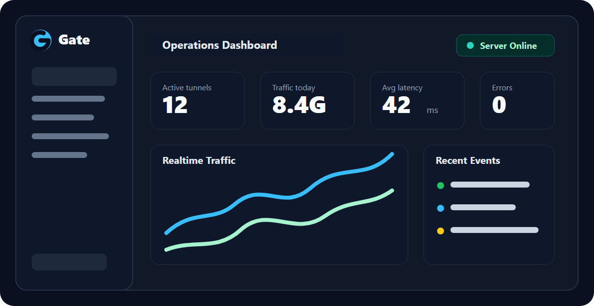
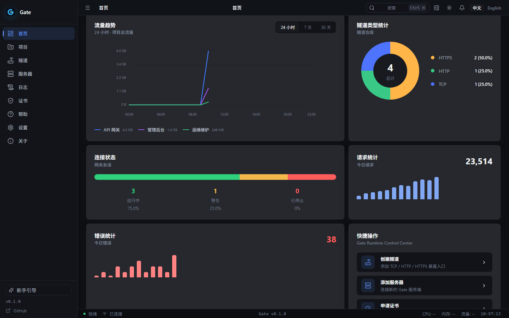
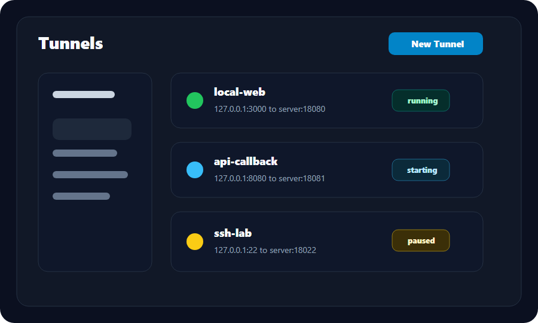
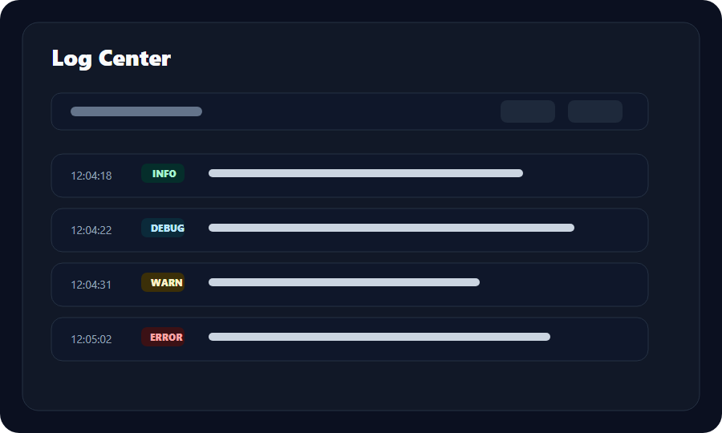

<p align="center">
  <a href="https://gitee.com/lancemorii-git/gate">
    
  </a>
</p>

<h1 align="center">Gate</h1>

<p align="center">
  面向自部署场景的隧道基础设施，用你自己的服务器暴露私有 TCP 与 HTTP 服务。
</p>

<p align="center">
  <strong>Rust 运行时。Tauri 桌面客户端。Docker 部署。为重视可控性的团队而建。</strong>
</p>

<p align="center">
  <a href="./README.md">English</a>
  ·
  <a href="./docs/README.md">文档</a>
  ·
  <a href="./examples/README.md">示例</a>
  ·
  <a href="./ROADMAP.md">路线图</a>
  ·
  <a href="./CONTRIBUTING.md">贡献指南</a>
</p>

<p align="center">
  
</p>

## Gate 是什么？

Gate 是一个开源隧道项目，目标是让团队通过自己控制的公网入口访问内网、本地开发机或私有服务。项目包含 Rust 服务端与运行时基础、Tauri 桌面客户端、认证、心跳、监控视图、Docker 部署模板，以及面向开源维护的文档与社区规范。

Gate 当前处于 pre-1.0 alpha 阶段。服务端认证、协议与运行时基础已经存在，Tunnel 体验、桌面客户端流程和生产级稳定性仍在持续完善。

## 为什么选择 Gate？

| 需求 | Gate 的方式 |
| --- | --- |
| 流量与入口可控 | 服务器部署在你自己的 VPS、实验室机器或私有云上。 |
| 避免 SaaS 绑定 | 配置、部署、示例和说明全部在仓库中维护。 |
| 给团队一个可视化工作台 | 桌面客户端覆盖项目、隧道、服务器、日志、设置等流程。 |
| 系统级技术基础 | Rust、Tokio、类型化协议 crate、集成测试与架构文档。 |
| 运维可复用 | Docker、发布说明、故障排查、基准测试模板与升级指南。 |

## 核心能力

- 自部署服务端运行时，包含 token 认证与心跳基础能力。
- Tauri、Vue、TypeScript、Pinia、Naive UI 构建的桌面客户端。
- 客户端提供项目、Tunnel、Server、Dashboard、Log Center、Settings 等界面。
- Rust workspace 拆分为 domain、application、infrastructure、protocol、communication、transport、engine、server、shared、integration 等模块。
- Docker 与 Compose 模板。
- 覆盖 TCP、Webhook、SSH、数据库、反向代理与常见后端框架的示例。
- 面向真实场景的示例。
- 维护者所需的文档、发布、基准测试、安全与贡献模板。

## 截图

| Dashboard | Tunnel Workspace | Log Center |
| --- | --- | --- |
|  |  |  |

截图规范见 [branding/screenshot-guidelines.md](./branding/screenshot-guidelines.md)。

## 快速开始

```bash
git clone https://gitee.com/lancemorii-git/gate.git
cd gate
cargo test --workspace
```

启动本机测试服务端。默认监听 `127.0.0.1:7000`，默认 Token 为 `gate-alpha-token`：

```bash
npm run dev:server
```

Windows 下也可以运行带提示的一键脚本：

```powershell
npm run dev:server:local
```

启动桌面客户端：

```bash
cd client
npm install
npm run tauri dev
```

完整说明见 [docs/quick-start.md](./docs/quick-start.md)。

## 安装

| 目标 | 命令 |
| --- | --- |
| 构建 workspace | `cargo build --workspace --release` |
| 从源码运行本机服务端 | `npm run dev:server` 或 `cargo run -p gate-server` |
| 安装本地服务端二进制 | `cargo install --path server` |
| 启动桌面 Web Shell | `cd client && npm install && npm run dev` |
| 启动桌面应用 | `cd client && npm install && npm run tauri dev` |

平台依赖见 [docs/installation.md](./docs/installation.md)。

## 部署

```bash
GATE_SERVER_ADDR=0.0.0.0:7000 \
GATE_AUTH_TOKEN=replace-with-a-long-random-token \
./target/release/gate-server
```

部署文档：

- [Server](./docs/server.md)
- [Deployment](./docs/deployment.md)
- [Docker](./docs/docker.md)
- [Upgrade](./docs/upgrade.md)
- [Troubleshooting](./docs/troubleshooting.md)

## Docker

```bash
docker build -f docker/Dockerfile.server -t gate-server:local .
docker run --rm -p 7000:7000 \
  -e GATE_SERVER_ADDR=0.0.0.0:7000 \
  -e GATE_AUTH_TOKEN=replace-me \
  gate-server:local
```

也可以使用 Compose：

```bash
docker compose -f docker/docker-compose.yml up -d
```

## 桌面客户端

桌面客户端面向偏好可视化操作的团队：

- 首次启动 Welcome Wizard。
- Server 管理自部署入口。
- Project 管理业务分组。
- Tunnel Wizard 创建端口映射。
- Dashboard 查看连接与流量健康。
- Log Center 过滤运行日志。

## 服务端配置

当前 alpha 服务端使用：

```bash
GATE_SERVER_ADDR=0.0.0.0:7000
GATE_AUTH_TOKEN=change-this-before-sharing-a-server
```

文档与示例使用的 Tunnel 配置模板：

```toml
[server]
address = "127.0.0.1:7000"
auth_token = "gate-alpha-token"

[tunnel]
name = "local-web"
protocol = "tcp"
local_host = "127.0.0.1"
local_port = 3000
remote_port = 18080
```

## 创建第一个 Tunnel

1. 在本机启动一个应用，例如 `127.0.0.1:3000`。
2. 运行 `npm run dev:server` 启动本机服务端；客户端里使用 Token `gate-alpha-token`。
3. 打开桌面客户端并添加 Server。
4. 创建名为 `local-web` 的 TCP Tunnel。
5. 设置本地端口 `3000`，远端端口 `18080`。
6. 启动 Tunnel，并在 Dashboard 与 Log Center 中验证流量。

## 常见使用场景

- 本地接收微信支付、支付宝、OpenAI 等回调。
- 调试 GitHub Webhook、Gitea、Jenkins 等集成。
- 受控访问 SSH、MySQL、Redis 与内部工具。
- 暴露 Node.js、Flask、Spring Boot、Go 服务给 QA 或协作者。
- 访问家庭服务器、NAS 或远程开发机。
- 评估自部署的 Cloudflare Tunnel 替代方案。

## Roadmap

当前路线图聚焦：

- 稳定 Tunnel 运行时行为。
- 完成桌面客户端核心流程。
- 完善 Docker 与发布打包。
- 发布真实基准测试数据。
- 改进认证、升级与备份策略。

详情见 [ROADMAP.md](./ROADMAP.md)。

## FAQ

**为什么选择 Gate？**
如果你想要一个自部署、可审计、带桌面管理体验、并且以 Rust 架构构建的隧道基础设施，Gate 值得关注。

**与 FRP 有什么区别？**
FRP 是成熟的隧道代理。Gate 是一个更年轻的项目，重点放在桌面优先的管理体验、类型化 Rust workspace 和开源项目可维护性上。Gate 目前还不是 FRP 的生产级平替。

**是否支持 Docker？**
支持。Docker 资产位于 [docker](./docker)，说明见 [docs/docker.md](./docs/docker.md)。

**是否支持 HTTPS？**
现阶段建议通过反向代理做 TLS 终止，原生 HTTPS 能力会随路线图完善。

**是否免费？**
是。Gate 使用 MIT License 开源。

更多问题见 [docs/faq.md](./docs/faq.md)。

## 贡献

欢迎贡献文档、示例、测试、打包、问题复现与代码改进。开始前请阅读：

- [CONTRIBUTING.md](./CONTRIBUTING.md)
- [docs/developer-guide.md](./docs/developer-guide.md)
- [docs/contribution.md](./docs/contribution.md)
- [CODE_OF_CONDUCT.md](./CODE_OF_CONDUCT.md)

## License

Gate 使用 [MIT License](./LICENSE)。

## Star Gate

如果 Gate 对你有帮助，欢迎给仓库一个 Star。它会帮助更多开发者发现项目，也会给维护者一个清晰的开源反馈信号。
