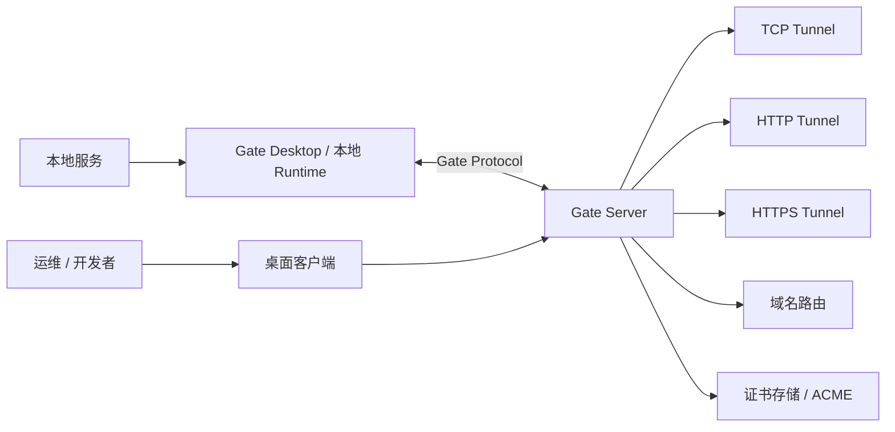

<p align="center">
  
</p>

<h1 align="center">Gate</h1>

<p align="center">
  自托管隧道平台，支持 TCP、HTTP、HTTPS、域名、证书和桌面端管理工作流。
</p>

<p align="center">
  <a href="README.md">English</a> ·
  <a href="docs/README.md">文档</a> ·
  <a href="CONTRIBUTING.md">贡献指南</a> ·
  <a href="SECURITY.md">安全策略</a>
</p>

---

## Gate 是什么？

Gate 是一个开源、自托管的隧道项目，用于通过你自己的服务器基础设施暴露本地服务。它由 Rust 服务端、Tauri 桌面客户端，以及模块化协议和运行时工作区组成，让团队可以在不依赖托管 SaaS 控制平面的情况下管理隧道。

Gate v0.9 聚焦成熟开源发布基础：清晰文档、可复现构建、桌面端打包、Docker 部署和 Release 自动化。

## 核心能力

- **TCP Tunnel**：通过 Gate 服务端暴露本地 TCP 服务。
- **HTTP Tunnel**：为 Webhook、本地应用和 QA 环境路由 HTTP 服务。
- **HTTPS Tunnel**：支持 HTTPS 场景和证书相关部署工作流。
- **Domain 管理**：组织服务端域名路由元数据。
- **Certificate 管理**：管理证书存储和 ACME 相关工作流。
- **Desktop Client**：通过 Tauri 桌面 UI 管理 Server、Project、Tunnel、诊断、日志和设置。
- **Docker 部署**：使用内置 Dockerfile 和 Compose 模板运行服务端。
- **Release 工程化**：通过 GitHub Actions tag 构建服务端二进制和桌面安装包。

## 截图

<p align="center">
  
</p>

| Dashboard | Tunnel 管理 | 日志 |
| --- | --- | --- |
|  |  |  |

## 架构图



## 快速开始

### 环境要求

- Rust 1.88+
- Node.js 20+
- npm 10+
- Git
- 如需构建桌面端，需要安装对应平台的 Tauri 依赖

### 从源码运行

```bash
git clone https://github.com/Somirk134/Gate.git
cd Gate
npm --prefix client ci
cargo check --workspace
cargo test --workspace
npm run typecheck
npm run build
```

启动服务端：

```bash
npm run dev:server
```

另开一个终端启动桌面客户端：

```bash
npm run dev:desktop
```

本地开发默认值：

- Server：`127.0.0.1:7000`
- Token：`gate-alpha-token`

不要在共享或公网环境使用开发默认 token。

## Docker 部署

本地构建：

```bash
docker build -f docker/Dockerfile.server -t gate-server:local .
```

使用 Docker Compose 在 Linux 服务器运行：

```bash
GATE_AUTH_TOKEN=replace-with-a-long-random-token \
docker compose up -d --build
```

默认 Compose 模板使用 Docker host 网络。请在服务器安全组/防火墙开放 `5800/tcp` 供桌面客户端连接；用户创建隧道时使用哪个 `remotePort`，就额外开放哪个端口。Bridge 网络兼容模板位于 `docker/docker-compose.bridge.yml`。

更多信息见 [Docker 文档](docs/user/docker.md) 和 [部署文档](docs/user/deployment.md)。

## 桌面客户端安装

Release 构建准备发布：

- Windows installer
- macOS Intel / Apple Silicon `.dmg`
- Linux `.AppImage` 和 `.deb`

在签名更新服务器可用之前，请从 GitHub Releases 手动下载安装包并升级。

本地构建桌面端：

```bash
npm --prefix client ci
npm --prefix client run tauri build
```

## 文档

- [Getting Started](docs/user/getting-started.md)
- [Installation](docs/user/installation.md)
- [Deployment](docs/user/deployment.md)
- [Configuration](docs/user/configuration.md)
- [Troubleshooting](docs/user/troubleshooting.md)
- [Architecture](docs/development/architecture.md)
- [Release Process](docs/development/release.md)

## 贡献方式

欢迎贡献。请先阅读：

- [CONTRIBUTING.md](CONTRIBUTING.md)
- [开发者文档](docs/development/contributing.md)
- [行为准则](CODE_OF_CONDUCT.md)
- [安全策略](SECURITY.md)

提交 Pull Request 前请运行：

```bash
cargo check --workspace
cargo test --workspace
npm run typecheck
npm run build
```

## License

Gate 基于 [MIT License](LICENSE) 开源。
