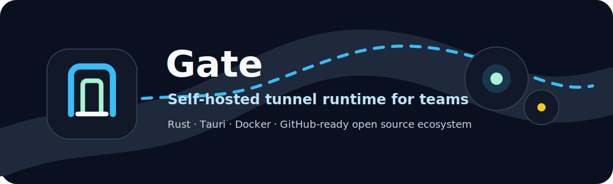
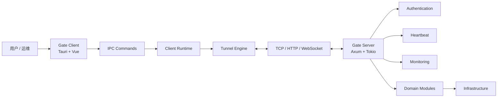
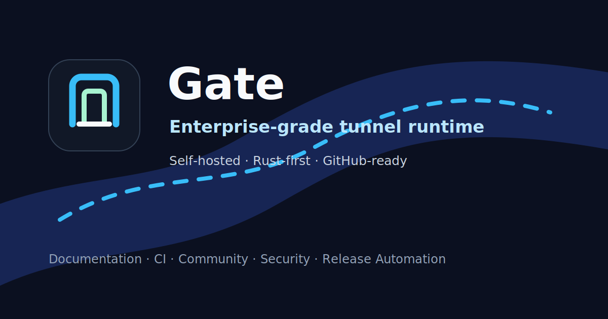

<p align="center">
  <a href="https://github.com/lancemorii-git/gate">
    
  </a>
</p>

<h1 align="center">Gate</h1>

<p align="center">
  面向团队与企业自托管场景的 Rust 隧道运行时与桌面客户端。
</p>

<p align="center">
  
</p>

<p align="center">
  <a href="./README.md">English</a>
  ·
  <a href="./docs/README.md">文档</a>
  ·
  <a href="./CONTRIBUTING.md">贡献指南</a>
  ·
  <a href="./SECURITY.md">安全策略</a>
  ·
  <a href="./ROADMAP.md">路线图</a>
</p>

<p align="center">
  <a href="https://www.rust-lang.org"></a>
  <a href="./LICENSE"></a>
  <a href="https://github.com/lancemorii-git/gate/releases"></a>
  <a href="https://github.com/lancemorii-git/gate/actions/workflows/ci.yml"></a>
  <a href="https://github.com/lancemorii-git/gate/actions/workflows/ci.yml"></a>
  
  
  
  <a href="https://github.com/lancemorii-git/gate/stargazers"></a>
  <a href="https://github.com/lancemorii-git/gate/issues"></a>
  <a href="https://github.com/lancemorii-git/gate/pulls"></a>
</p>

## 项目概览

Gate 是一个 Rust 优先的自托管隧道平台，包含桌面客户端、服务端运行时、认证、心跳、监控、集成测试与打包基础。本轮仓库整理聚焦开源生态建设：文档、CI、社区规范、安全策略、发布自动化、基准测试模板与统一品牌资产。

Gate 的目标不是绑定某个业务场景，而是为私有服务访问、团队协作和可控部署提供稳定的基础设施。

## 快速开始

```bash
git clone https://github.com/lancemorii-git/gate.git
cd gate

cargo test --workspace
cargo run -p gate-server
```

另开终端启动桌面客户端：

```bash
cd client
npm install
npm run tauri dev
```

## 核心特性

- Rust workspace 分层：domain、application、infrastructure、protocol、communication、transport、server、desktop runtime。
- Tauri 桌面客户端：Vue、TypeScript、IPC 命令、监控视图和打包钩子。
- 自托管服务端：认证、心跳、监控和集成测试基础已经就绪。
- Docker、Release、文档、Benchmark、安全与社区模板面向公开 GitHub 维护设计。
- 英文与简体中文双语文档结构。

## 架构



更多细节见 [ARCHITECTURE.md](./ARCHITECTURE.md) 与 [docs/architecture.md](./docs/architecture.md)。

## 截图

正式 UI 截图将在公开发布前补充。



## 安装

| 目标 | 命令 |
| --- | --- |
| 从源码安装服务端 | `cargo install --path server` |
| 构建 workspace | `cargo build --workspace --release` |
| 桌面开发模式 | `cd client && npm install && npm run tauri dev` |
| 文档站 | `cd website && npm install && npm run dev` |

完整说明见 [docs/install.md](./docs/install.md)。

## 快速部署

```bash
docker compose -f docker/docker-compose.yml up -d
```

生产环境部署前请阅读 [docs/deployment.md](./docs/deployment.md)、[docs/docker.md](./docs/docker.md) 和 [SECURITY.md](./SECURITY.md)。

## 配置

```bash
GATE_ENV=production
GATE_BIND=0.0.0.0:5800
GATE_LOG=info
GATE_DATA_DIR=/var/lib/gate
```

完整配置模板见 [docs/configuration.md](./docs/configuration.md)。

## 文档

| 主题 | 链接 |
| --- | --- |
| 快速开始 | [docs/quick-start.md](./docs/quick-start.md) |
| 安装 | [docs/install.md](./docs/install.md) |
| 配置 | [docs/configuration.md](./docs/configuration.md) |
| 隧道 | [docs/tunnel.md](./docs/tunnel.md) |
| 项目 | [docs/project.md](./docs/project.md) |
| 认证 | [docs/authentication.md](./docs/authentication.md) |
| 心跳 | [docs/heartbeat.md](./docs/heartbeat.md) |
| 监控 | [docs/monitoring.md](./docs/monitoring.md) |
| 部署 | [docs/deployment.md](./docs/deployment.md) |
| Docker | [docs/docker.md](./docs/docker.md) |
| 故障排查 | [docs/troubleshooting.md](./docs/troubleshooting.md) |
| 开发指南 | [docs/development-guide.md](./docs/development-guide.md) |
| 插件指南 | [docs/plugin-guide.md](./docs/plugin-guide.md) |
| API | [docs/api.md](./docs/api.md) |

VitePress 文档站位于 [website](./website)。

## FAQ

**Gate 是否适合生产环境？**  
Gate 仍处于 pre-1.0 阶段。建议先在受控环境中使用，等 v1 稳定性目标完成后再扩大生产范围。

**Gate 是否支持自托管？**  
支持。自托管是 Gate 的核心目标。

**必须使用 Docker 吗？**  
不必须。Docker 是可选部署方式，也支持源码构建和原生包。

**插件系统是否可用？**  
插件指南目前为预留内容。公开 API 和兼容性规则会在 v1.5 前逐步明确。

## 路线图

路线图见 [ROADMAP.md](./ROADMAP.md)，采用 GitHub Project 风格维护：Todo、In Progress、Review、Done、Roadmap、Milestone。

## 贡献

欢迎贡献。非小型改动请先创建 issue 或 discussion。开始前请阅读 [CONTRIBUTING.md](./CONTRIBUTING.md) 与 [community/contribution-workflow.md](./community/contribution-workflow.md)。

## 许可证

Gate 使用 [MIT License](./LICENSE)。Apache-2.0 与双许可证模式作为未来治理选项预留。

## 赞助

赞助入口预留在 [SPONSORS.md](./SPONSORS.md) 和 [.github/FUNDING.yml](./.github/FUNDING.yml)。

## Star History

Star History 会在 GitHub 公开发版后接入。

```text
https://star-history.com/#lancemorii-git/gate&Date
```
