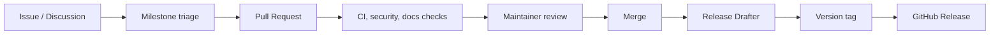

# Roadmap

Gate uses GitHub Project-style planning. The sections below map to project columns and milestones.

## Project Columns

| Column | Meaning |
| --- | --- |
| Todo | Accepted work that has not started |
| In Progress | Actively being implemented |
| Review | Waiting for code review, design review, or release validation |
| Done | Completed and released or merged |
| Roadmap | Larger initiatives not yet broken down |
| Milestone | Version-scoped goals with release criteria |

## V1

| Status | Item | Success Criteria |
| --- | --- | --- |
| In Progress | Runtime hardening | Core tunnel lifecycle has integration coverage |
| In Progress | Authentication policy | Token handling and session validation documented |
| Todo | Release automation | Tagged release publishes server assets and client packages |
| Todo | Operator documentation | Quick start, install, configuration, deployment, troubleshooting complete |
| Todo | Security baseline | CodeQL, dependency updates, responsible disclosure live |

## V1.1

| Status | Item | Success Criteria |
| --- | --- | --- |
| Roadmap | Production Docker profile | Compose and Dockerfile are validated in CI |
| Roadmap | Monitoring dashboard polish | Runtime metrics documented with troubleshooting guidance |
| Roadmap | Benchmark reports | CPU, memory, latency, connection, binary size templates populated |

## V1.5

| Status | Item | Success Criteria |
| --- | --- | --- |
| Roadmap | Plugin guide | Public extension points and compatibility rules documented |
| Roadmap | API reference | Stable REST/WebSocket references published |
| Roadmap | Multi-node operations | Self-hosted and reverse proxy examples verified |

## V2

| Status | Item | Success Criteria |
| --- | --- | --- |
| Roadmap | Enterprise operations | Audit-ready configuration and deployment guides |
| Roadmap | Advanced policy controls | Access, rate, and lifecycle policies documented |
| Roadmap | High availability design | HA architecture and failure modes published |

## V3

| Status | Item | Success Criteria |
| --- | --- | --- |
| Roadmap | Ecosystem maturity | Plugins, SDKs, and long-term compatibility policy |
| Roadmap | Governance model | Maintainer ladder, RFC process, release council |
| Roadmap | Long-term support | LTS support window and migration guides |

## Release Flow

