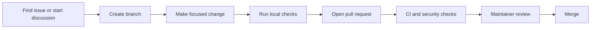

# Contribution Workflow

## Flow



## Local Checks

```bash
cargo fmt --all --check
cargo clippy --workspace --all-targets --all-features -- -D warnings
cargo test --workspace --all-features
npm --prefix client run typecheck
```

## Review Tips

- Explain why the change is needed.
- Keep screenshots for UI changes.
- Update docs for user-visible behavior.
- Note breaking changes clearly.
