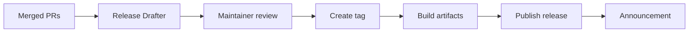

# Release Policy

Gate releases are automated where possible and reviewed by maintainers.

## Versioning

- Pre-1.0 versions may include breaking changes.
- Breaking changes must be called out in release notes.
- Stable compatibility policy starts at v1.

## Release Checklist

- CI passes on the release branch or tag.
- Security scans complete.
- Changelog and release notes are reviewed.
- Docker and documentation builds are validated.
- Artifacts are attached to GitHub Release.

## Release Flow

