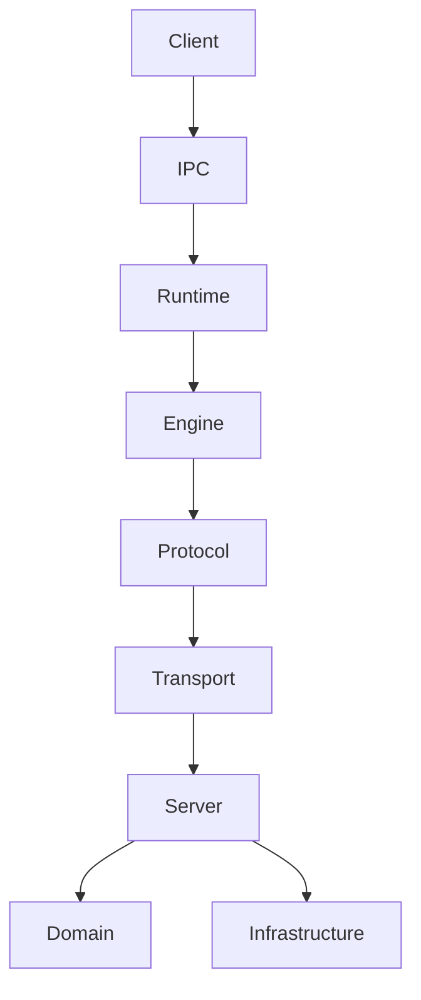

# Architecture Map

```mermaid
flowchart TD
  Client["Client"] --> IPC["IPC"]
  IPC --> Runtime["Runtime"]
  Runtime --> Engine["Engine"]
  Engine --> Protocol["Protocol"]
  Protocol --> Transport["Transport"]
  Transport --> Server["Server"]
  Server --> Domain["Domain"]
  Server --> Infra["Infrastructure"]
```

Use this map as the starting point for architecture diagrams in issues, pull requests, and docs.
