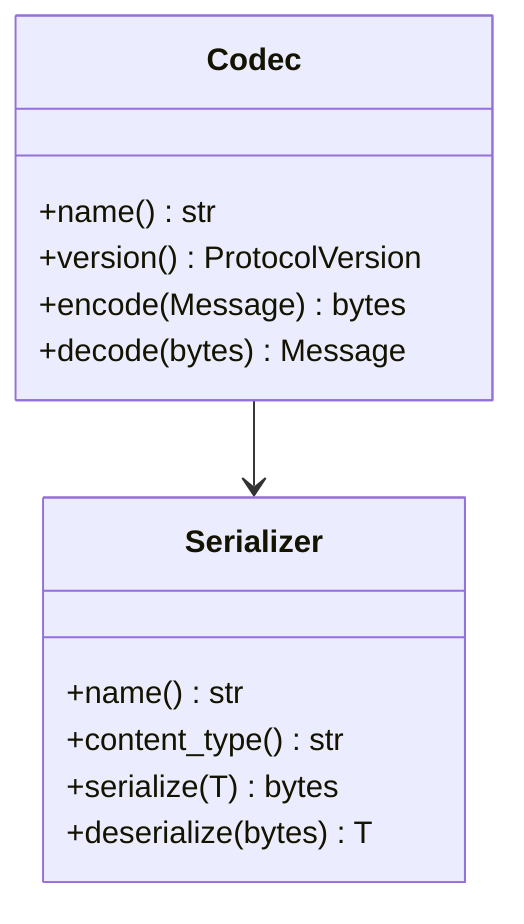

# Codec

Codecs transform complete `Message` values into bytes and back. They never
serialize arbitrary business data directly.

## Interfaces

## V1

- `JsonCodec`
- `JsonSerializer`
- Serde models
- Tokio-compatible transport boundaries

## Reserved

The following codecs are named and reserved for future implementation:

- `MessagePackCodec`
- `CborCodec`
- `ProtobufCodec`

They currently return unsupported codec errors by design.
