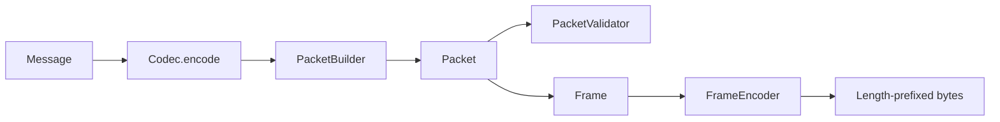

# Packet

`Packet` is the boundary between encoded protocol messages and transport frames.
It carries encoded bytes, a packet id, a protocol version, and optional checksum
metadata. It does not open sockets or forward tunnel data.

## Data Flow

## Responsibilities

- `PacketBuilder` creates packets from encoded payloads or messages.
- `PacketParser` parses frames and decodes packet payloads with a selected codec.
- `PacketValidator` enforces payload presence and maximum size.
- `PacketReader` and `PacketWriter` are traits for future adapters.
- `PacketError` represents invalid packet, header, body, and size failures.

## Framing

V1 uses a 4-byte big-endian length prefix followed by payload bytes. The frame
module is prepared for sticky packet, split packet, and future fragmentation
handling.
