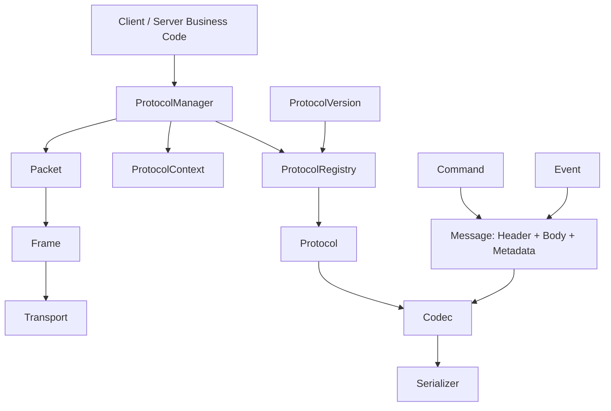
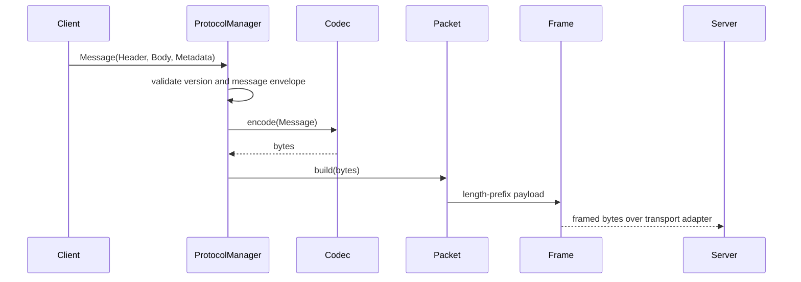

# Gate Protocol

Gate Protocol is the single client-server communication contract for Desktop
Client, Rust Server, and future protocol adapters. V1 uses TCP-compatible
framing, JSON payloads, Serde data models, and Tokio-friendly transport traits.

This layer must not implement business behavior. Project, tunnel, server, log,
statistics, heartbeat, authentication, and system operations are represented as
commands and messages only.

## Module Graph



## Message Contract

Every payload must be sent as a `Message`.

```text
Message
  Header
    ProtocolVersion
    MessageType
    Command
    RequestId
    TraceId
    Timestamp
    Compression
    Encryption
    Sequence
    BodyLength
    Reserved
  Body
    Json | Binary | PluginPayload | Empty
  Metadata
    ClientVersion
    Platform
    OS
    Language
    Architecture
    Extra
```

## Sequence



## State Machines

The protocol crate defines state enums only:

- `ConnectionState`
- `ProtocolState`
- `AuthenticationState`
- `TunnelState`

State transitions are owned by higher layers.

## Coding Convention

- Protocol types are stable, serde-friendly, and versioned.
- No naked payloads are allowed on the wire.
- Codecs operate on complete `Message` values.
- Serializers are format helpers and remain independent from codecs.
- Reserved features must expose interfaces without implementing business logic.
- Error reporting uses `ErrorCode` plus typed Rust errors.
