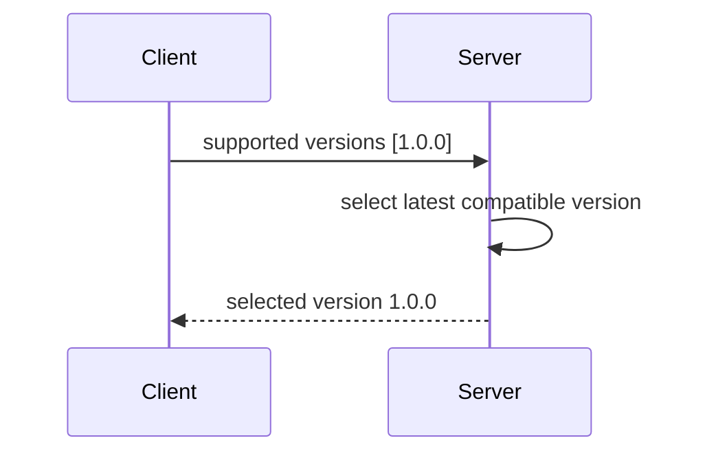

# Version

`ProtocolVersion` is present in every message header and every registry entry.
V1 is `1.0.0`.

## Negotiation

## Policies

- `Exact`: versions must be identical.
- `SameMajor`: major versions must match.
- `LatestCompatible`: choose the highest compatible local version.

Protocol versions are registered in `ProtocolRegistry`, and
`ProtocolManager` switches the active version after successful negotiation.
