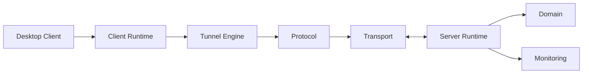

# Architecture

This page summarizes the public architecture. See the root [ARCHITECTURE.md](../ARCHITECTURE.md)
for repository-level diagrams.

## High-Level System

## Boundaries

- UI code lives under `client/src`.
- Tauri backend code lives under `client/src-tauri`.
- Deployable server bootstrap lives under `server`.
- Reusable runtime logic lives under `crates`.
- Integration tests live under `integration`.
- Public documentation lives under `docs` and `website`.

## Change Rule

When changing behavior across a boundary, update tests and documentation in the same pull request.
