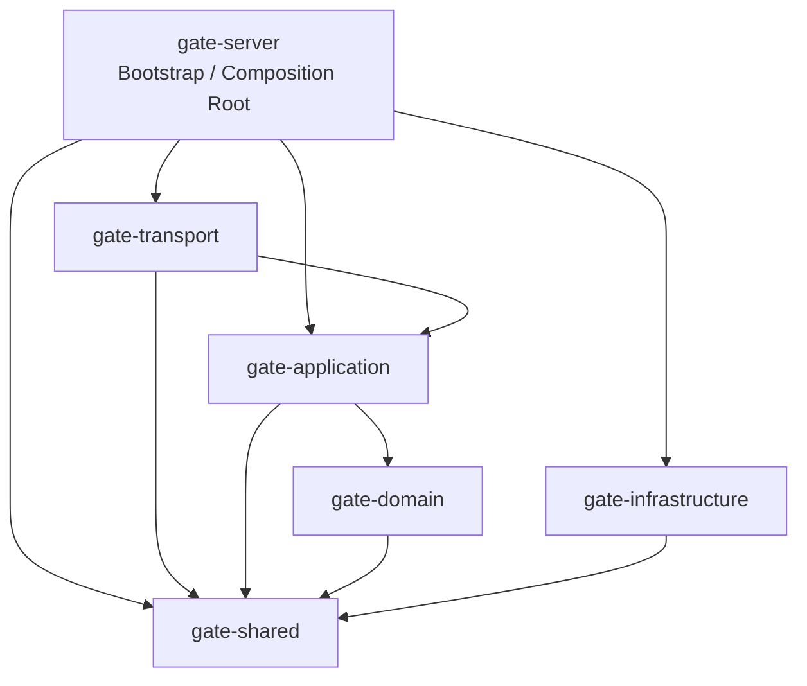

# Gate Rust Server Architecture

本阶段目标是建立企业级 Rust 服务端基础架构，不实现业务逻辑、Tunnel、转发、认证、数据库或具体网络协议。

## Workspace

```text
Gate/
├── server/                    # 启动壳与未来 Application Runtime 组合根
├── shared/                    # Shared Kernel：错误、生命周期、配置、DI、事件、健康、日志、调度契约
├── crates/
│   ├── domain/                # 领域模块边界与 Repository Trait
│   ├── application/           # UseCase / Command / Query / Handler / Dispatcher Trait
│   ├── infrastructure/        # Storage / Config / Logger / Cache / Network / Runtime / Scheduler Port
│   └── transport/             # TCP 当前预留，HTTP / IPC / WebSocket 未来预留
├── examples/                  # 示例预留，不放生产逻辑
├── scripts/                   # 工程脚本与 CI 入口预留
├── docs/                      # 架构与工程规范
└── tests/
    ├── unit/
    ├── integration/
    ├── mock/
    └── fixtures/
```

## Crate 划分

| Crate | 职责 | 禁止 |
| --- | --- | --- |
| `gate-server` | 进程入口、启动壳、未来组合根 | 业务规则、协议处理、数据库访问 |
| `gate-shared` | 跨层共享的基础契约 | 领域模型字段、具体基础设施实现 |
| `gate-domain` | 领域目录、领域 Repository Trait | 数据库实现、HTTP/TCP 细节、应用编排 |
| `gate-application` | 用例边界、命令/查询/处理器/调度器接口 | 传输协议、存储细节 |
| `gate-infrastructure` | 基础设施端口定义 | SQLx/Redis/File/Network 具体实现 |
| `gate-transport` | 传输层端口定义 | 协议实现、端口监听、转发 |

## 依赖方向

Clean Architecture 的依赖只能从外层指向内层或共享内核，禁止反向依赖和循环依赖。



## Server Architecture

服务端按 DDD + Clean Architecture 分层：

- `domain`：领域模块边界、实体文件位置、领域事件文件位置、Repository Trait。
- `application`：UseCase、Command、Query、Handler、Dispatcher、EventHandler 的抽象。
- `infrastructure`：Storage、Config、Logger、Cache、Network、Runtime、Scheduler 的端口。
- `transport`：TCP 作为当前预留入口，HTTP/IPC/WebSocket 只保留未来位置。
- `shared`：错误体系、生命周期、配置中心契约、DI、事件总线、健康检查、日志配置、任务调度契约。

## 本阶段边界

必须保持：

- 不实现 Tunnel。
- 不实现转发。
- 不实现认证。
- 不实现数据库。
- 不启动真实 TCP/HTTP/WebSocket/IPC 服务。
- 不写业务 UseCase。
- 不写测试用例，仅保留测试目录。

