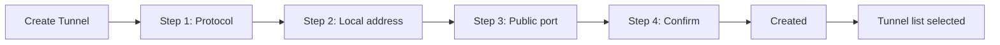
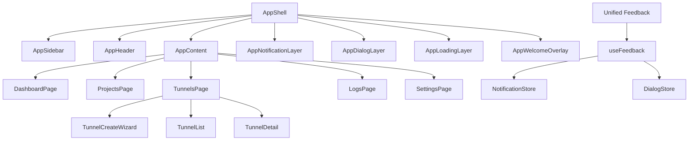

# Beta Sprint 1 UX Review Report

## 1. First-Run UX Review

### Experience Problems

- Dashboard looked like a monitoring console, not a desktop app home screen. The first screen exposed too many charts and system terms before answering "am I connected?"
- Tunnel creation exposed too many fields at once. New users had to understand protocol, local address, remote port, project, server, tags, and startup behavior in one pass.
- Project management had useful mechanics, but the page read as a generic admin grid. Recent use, running count, tags, and status color were not the first scanning layer.
- Logs had strong terminal aesthetics. It supported search/filter/export/pause, but the black console made it feel like raw output rather than a readable app surface.
- Settings were too broad and flat. More than a dozen categories made it hard to know where common preferences live.
- Feedback was split between Naive UI message/dialog and the app's own notification/dialog layers, creating inconsistent motion, position, and tone.
- Some empty states relied on basic placeholders. Empty screens need a clear next action.
- Loading, dialog, toast, hover, and page transitions used related but not fully unified motion rules.

### Confusing Areas

- "Monitoring Center" on the home page suggested the app is primarily observability software.
- Tunnel detail tabs created a heavy workspace before the user had learned the basic mental model.
- Settings categories such as workspace/project/storage/security/update/developer/experimental were all top-level, so common actions competed with advanced options.
- Version and runtime status were not visible enough for beta users.

### Too Much Information

- Dashboard charts, system health, runtime panels, connection statistics, and tunnel statistics all appeared at once.
- Tunnel detail exposed many sub-tabs and inspector content.
- Settings exposed every category equally.

### Too Little Information

- First launch lacked a guided "what should I do first?"
- Dashboard did not summarize current connection state, server health, tunnel count, today traffic, real-time speed, runtime, recent logs, and version in one glance.
- Empty states did not always explain the next step.

### Modern Desktop Design Gaps

- Surfaces needed quieter density, fewer nested cards, and stronger hierarchy.
- Important controls needed stable icon usage, accessible focus, and consistent states.
- App-level feedback needed one notification center and one dialog pattern.
- Responsive behavior for wide screens and narrow windows needed explicit grid rules.

## 2. New Page Structure

```mermaid
flowchart TD
  App["Gate Desktop"] --> Welcome["Welcome - first launch"]
  App --> Dashboard["Dashboard"]
  App --> Projects["Projects"]
  App --> Tunnels["Tunnels"]
  App --> Logs["Logs"]
  App --> Settings["Settings"]
  App --> About["About"]

  Dashboard --> Status["Connection status"]
  Dashboard --> Health["Server status"]
  Dashboard --> Metrics["Tunnel count / traffic / speed / uptime"]
  Dashboard --> RecentLogs["Recent logs"]
  Dashboard --> Version["Version info"]

  Tunnels --> Wizard["Create Tunnel Wizard"]
  Tunnels --> List["Tunnel list"]
  Tunnels --> Detail["Tunnel detail"]

  Projects --> Search["Search"]
  Projects --> Sort["Sort"]
  Projects --> Tags["Tags"]
  Projects --> StatusColor["Status colors"]

  Logs --> SearchLogs["Search"]
  Logs --> FilterLogs["Level/source filters"]
  Logs --> ExportLogs["Copy/export"]
  Logs --> ScrollMode["Pause/auto-scroll"]

  Settings --> General
  Settings --> Network
  Settings --> Server
  Settings --> Tunnel
  Settings --> Appearance
  Settings --> Advanced
  Settings --> AboutSettings["About"]
```

## 3. Create Tunnel Flow

## 4. Component Tree

## 5. UI Specification

### Design Tokens

- Primary: `--color-primary`
- Success: `--color-success`
- Warning: `--color-warning`
- Error: `--color-error`
- Info: `--color-info`
- Background: `--bg-app`, `--bg-surface`, `--bg-card`
- Border: `--border-subtle`, `--border-default`, `--border-strong`
- Text: `--text-primary`, `--text-secondary`, `--text-tertiary`
- Hover: `--bg-surface-hover`

### Spacing

- Base spacing scale: 4, 8, 12, 16, 24, 32, 48, 64.
- Toolbars use 8-12px internal gaps.
- Page sections use 16-24px gaps.
- Dense rows use fixed 32-38px control heights.

### Motion

- Hover and control feedback: 140ms ease-out.
- Page/Dialog/Toast entrance: 200-300ms ease-out.
- Reduced-motion users receive near-zero duration transitions.

### Icons

- All new UI uses `GIcon`, backed by Lucide.
- Icon-only actions expose button labels through `aria-label` or `title` where relevant.

## 6. Accessibility Checklist

- Keyboard focus uses the global `:focus-visible` ring.
- Dialog overlays support ESC close.
- Wizard and Welcome overlays use `role="dialog"` and `aria-modal`.
- Inputs retain native keyboard behavior.
- Buttons use semantic `button` elements.
- Text sizing avoids viewport-scaled typography.
- Color is never the only state signal; status text remains visible.

## 7. Responsive Behavior

- 1080p: two-column workspaces remain readable.
- 2K/4K: content is constrained by `--content-max-width`.
- Ultra-wide: dashboard and cards do not stretch indefinitely.
- Narrow windows: project/tunnel/settings grids collapse to one column.
- Logs hide side inspectors at smaller widths while preserving the output panel.

## 8. Performance Review

### Current Risks

- Several pages load large mock datasets immediately; real data should use pagination or virtualization.
- Logs already virtualize rows, which should remain a pattern for high-volume lists.
- Realtime monitoring ticks can trigger frequent updates across many Tunnel objects.
- Page-level computed filters should avoid deep watchers over large arrays.
- IPC/Rust commands should be batched for dashboard summary data instead of issuing many small commands after real integration.

### Recommendations

- Keep Dashboard backed by a single summarized snapshot command.
- Use virtual lists for Tunnel and Project once real counts exceed a few hundred.
- Debounce search inputs at 100-150ms when connected to real stores.
- Avoid deep `watch` on whole route/store objects unless necessary.
- Keep monitor polling offscreen-aware when the app window is hidden.
- Track startup budget: shell render first, then load dashboard data.

## 9. Implementation Summary

- Reworked Dashboard into a status-first home page.
- Added first-launch Welcome overlay with "do not show again".
- Added Create Tunnel Wizard: protocol, local address, public port, confirm, success.
- Reworked Tunnel page into a focused list/detail workspace.
- Reworked Project page around search, sort, tags, recent use, status color, running counts, and favorites.
- Reworked Logs visual style away from terminal aesthetics while keeping search/filter/copy/export/pause/auto-scroll.
- Reworked Settings into General, Network, Server, Tunnel, Appearance, Advanced, About.
- Unified notification and dialog calls through app stores.
- Rebuilt design tokens and motion tokens for consistent color, spacing, animation, and focus behavior.
