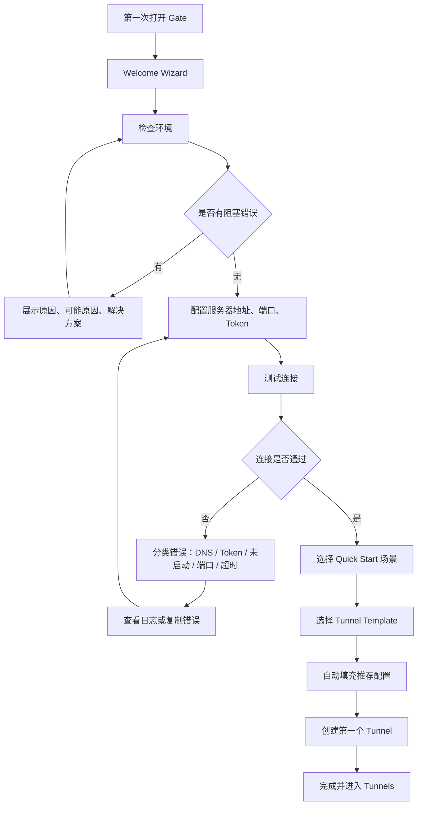
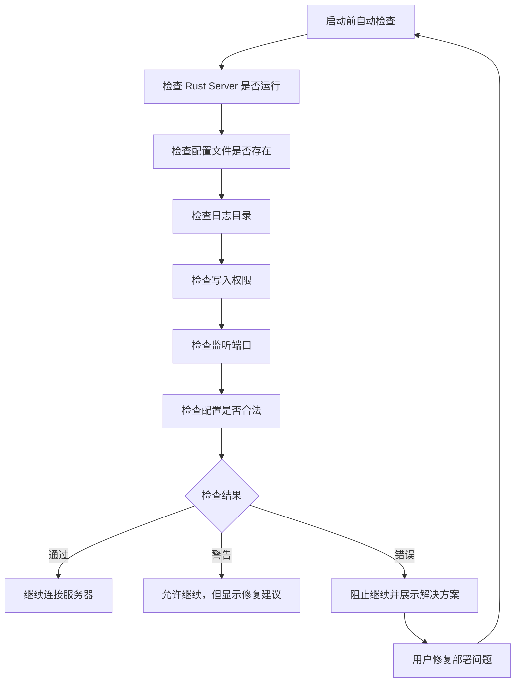
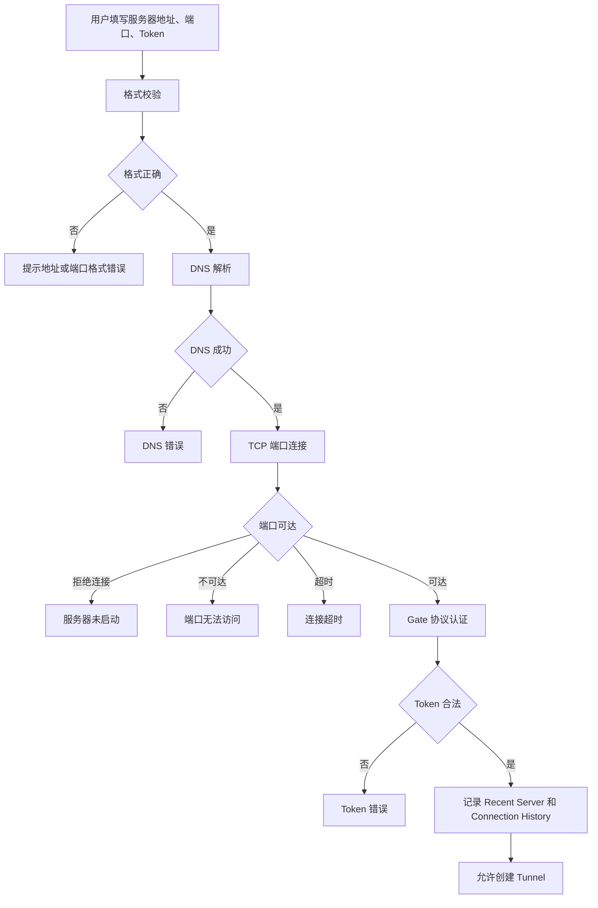

# Beta Sprint 2: Deployment and Onboarding UX

目标：开发者第一次下载 Gate 后，不阅读文档，也能在 5 分钟内完成部署、连接服务器并创建第一个 Tunnel。

本 Sprint 不新增核心能力，不新增 Tunnel 协议，不新增 P2P，不新增新的 HTTP 能力。所有改动围绕部署流程、配置流程、首次使用体验、错误提示和诊断工具。

## 新手体验方案

1. 首次启动不直接暴露 Dashboard，而是显示 Welcome Wizard。
2. Welcome Wizard 按 `Welcome -> 检查环境 -> 配置服务器 -> 测试连接 -> 创建第一个 Tunnel -> 完成` 推进。
3. Server Connection Wizard 要求用户只填写服务器地址、端口和 Token，并提供实时状态反馈。
4. 连接测试必须给出结构化错误：错误原因、可能原因、解决方案、查看日志和复制错误。
5. Quick Start 提供本地开发、支付回调、Webhook、SSH、数据库、NAS、Docker 等场景。
6. Tunnel Template 只生成推荐配置，不改变协议层。HTTP 作为预留模板展示。
7. Diagnostics Center 聚合 Connection Diagnostics、Deployment Checker、Version Checker、System Info、Recent Server 和 Connection History。
8. Settings 增加恢复默认设置、导出配置、导入配置、备份配置、重置缓存、清理日志。
9. Feedback 页面支持复制调试信息、打开 GitHub Issue、查看日志目录、查看配置目录、生成诊断信息。

## 首次使用流程图

## 部署流程图

## 连接流程图

## 验收标准

- 首次启动向导覆盖首屏，用户不需要先理解 Dashboard。
- 服务器连接失败不再显示泛化的 `Connection Failed`。
- 诊断页能输出部署检查、连接检查、版本信息和系统信息。
- 设置页所有维护操作都有可视化入口。
- 反馈页能一键复制可提交的调试信息。
- Tunnel 创建向导支持 Quick Start 和 Template 自动填充。
- 不引入新协议，不新增 HTTP/P2P 等核心能力。
