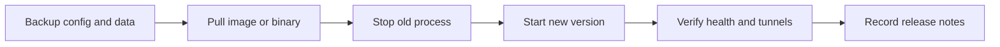

# Deployment

Gate deployment should be explicit, repeatable, and observable.

## Deployment Targets

| Target | Status | Notes |
| --- | --- | --- |
| Local source run | Supported | Development and debugging |
| Docker Compose | Supported template | Recommended for first self-hosted deployment |
| systemd | Template reserved | Suitable for Linux servers |
| Kubernetes | Reserved | Use after health and metrics are stable |
| Reverse proxy | Supported example | Terminate TLS and manage host routing |

## Production Checklist

- Use a non-development bind address intentionally.
- Configure TLS at the reverse proxy or native runtime layer.
- Store secrets outside images and git.
- Enable log collection.
- Test restart behavior.
- Validate heartbeat under proxy idle timeouts.
- Record the deployed version and configuration.

## Release Upgrade Flow

