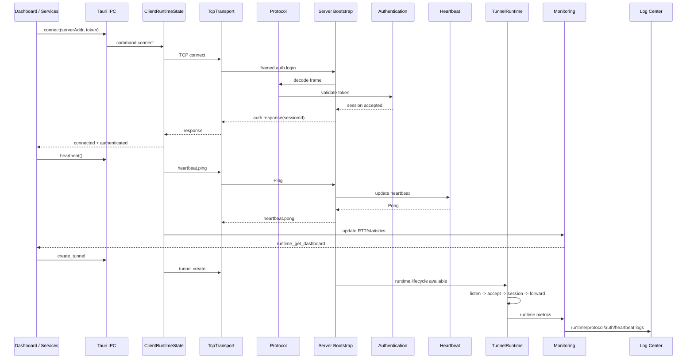

# Integration

Alpha V1 integration connects real module boundaries and keeps mocks out of the runtime path. Test mocks may remain under dedicated mock/test directories.

## Full Link Sequence

## Integrated Modules

- Client: `CommunicationService`, auth/tunnel/connection/project/server service facades, Tauri IPC, monitoring services.
- Server: boot, listen, accept, authenticate, heartbeat, statistics, shutdown.
- Protocol: framed JSON V1 request/response/event/heartbeat messages.
- Communication: real `TcpTransport`, reconnect, send, receive.
- Tunnel: real `TunnelRuntime`, TCP listener, connector, session manager, forward pipeline, runtime metrics.
- Dashboard: live runtime dashboard via `runtime_get_dashboard`.
- Log Center: runtime logs via `runtime_get_logs`.
- Settings: runtime config via `get_config` and `set_config`.

## Mock Cleanup Rule

- Runtime paths must not instantiate mock services.
- Mock data may remain only for isolated component or mock tests.
- New integration tests must use `gate-integration` harness, `TcpTransport`, and `TunnelRuntime`.
