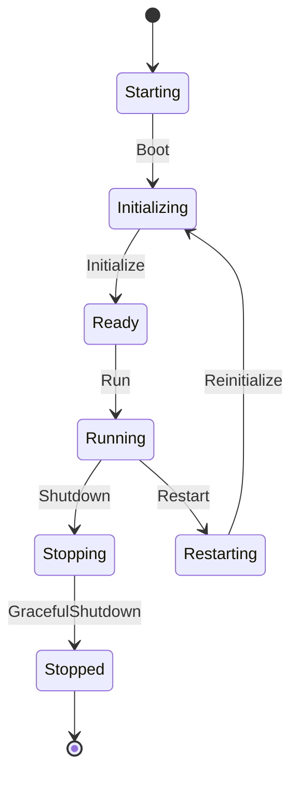

# Gate Server Lifecycle

## Server State

缁熶竴鐘舵€佸畾涔夊湪 `gate_shared::lifecycle::ServerState`锛?

- `Starting`
- `Initializing`
- `Ready`
- `Running`
- `Stopping`
- `Stopped`
- `Restarting`

## Runtime Phase

Application Runtime 鐨勯樁娈靛畾涔変负锛?

- `Boot`
- `Initialize`
- `Ready`
- `Running`
- `Shutdown`
- `Restart`
- `GracefulShutdown`

## Transition Design



## Runtime Contract

`ApplicationRuntime` 鍙毚闇茬姸鎬佽鍙栧拰闃舵鍒囨崲锛?

```rust
pub trait ApplicationRuntime: Send + Sync {
    fn state(&self) -> ServerState;
    fn transition(&self, phase: RuntimePhase) -> Result<ServerState, AppError>;
}
```

`GracefulShutdown` 鍙弿杩板叧闂竟鐣岋細

```rust
pub trait GracefulShutdown: Send + Sync {
    fn shutdown(&self) -> Result<(), AppError>;
}
```

## Graceful Shutdown

鏈潵瀹炵幇 graceful shutdown 鏃跺繀椤荤粺涓€绠＄悊锛?

- 鍋滄鎺ユ敹鏂拌繛鎺ャ€?- 閫氱煡璋冨害鍣ㄦ殏鍋滀换鍔°€?- 绛夊緟杩愯涓换鍔″湪閰嶇疆瓒呮椂鏃堕棿鍐呭畬鎴愩€?- Flush tracing sink銆?- 閲婃斁鍩虹璁炬柦缁勪欢銆?- 鐘舵€佹渶缁堣繘鍏?`Stopped`銆?
  褰撳墠闃舵涓嶅疄鐜颁笂杩拌涓猴紝鍙繚鐣欑敓鍛藉懆鏈熷绾︺€?
