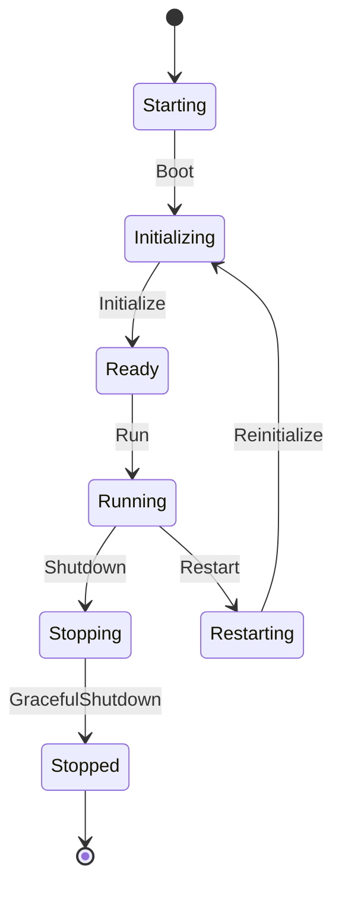

# Gate Server Lifecycle

## Server State

统一状态定义在 `gate_shared::lifecycle::ServerState`：

- `Starting`
- `Initializing`
- `Ready`
- `Running`
- `Stopping`
- `Stopped`
- `Restarting`

## Runtime Phase

Application Runtime 的阶段定义为：

- `Boot`
- `Initialize`
- `Ready`
- `Running`
- `Shutdown`
- `Restart`
- `GracefulShutdown`

## Transition Design



## Runtime Contract

`ApplicationRuntime` 只暴露状态读取和阶段切换：

```rust
pub trait ApplicationRuntime: Send + Sync {
    fn state(&self) -> ServerState;
    fn transition(&self, phase: RuntimePhase) -> Result<ServerState, AppError>;
}
```

`GracefulShutdown` 只描述关闭边界：

```rust
pub trait GracefulShutdown: Send + Sync {
    fn shutdown(&self) -> Result<(), AppError>;
}
```

## Graceful Shutdown

未来实现 graceful shutdown 时必须统一管理：

- 停止接收新连接。
- 通知调度器暂停任务。
- 等待运行中任务在配置超时时间内完成。
- Flush tracing sink。
- 释放基础设施组件。
- 状态最终进入 `Stopped`。

当前阶段不实现上述行为，只保留生命周期契约。

