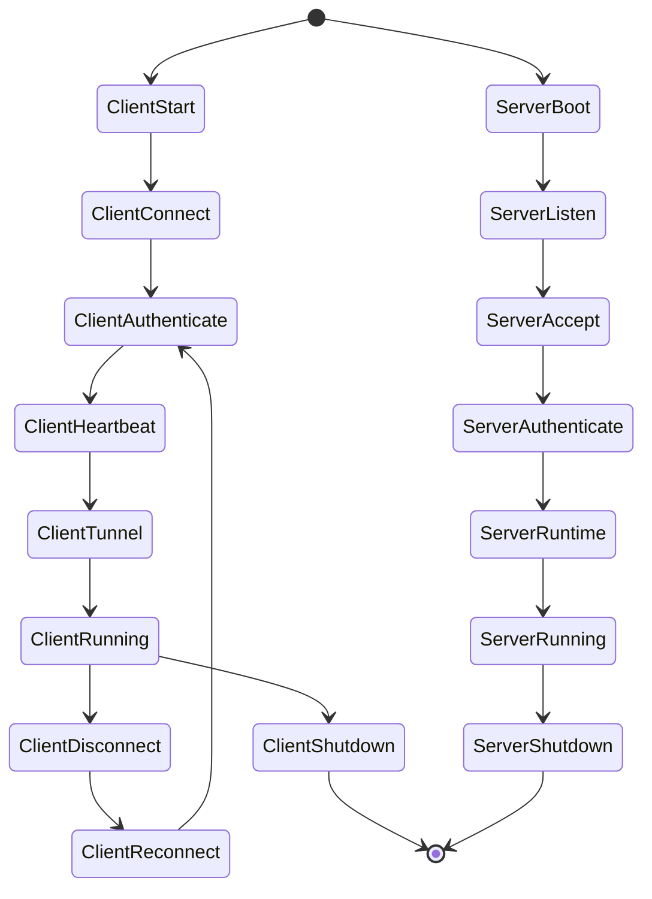
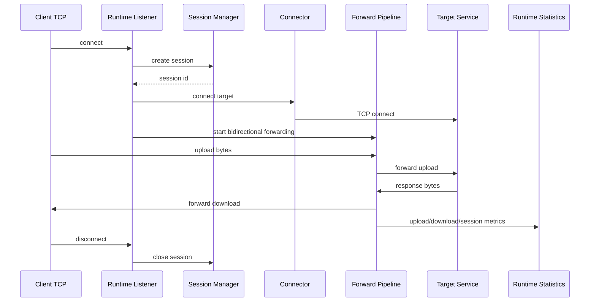

# Runtime Flow

## Lifecycle

## Tunnel Flow

## Error Handling

- Client errors flow through service promises, UI error states, notification/toast handlers, and runtime logs.
- Server errors use tracing logs and structured protocol error responses.
- Recoverable connection loss uses reconnect through `TcpTransport::reconnect`.
- Authentication failure returns `AUTH_FAILED` and closes the session.
