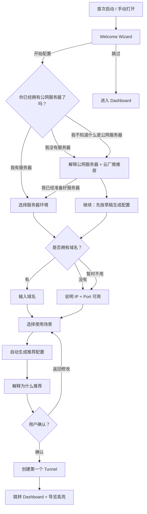
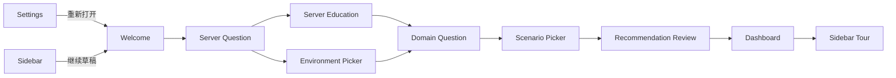
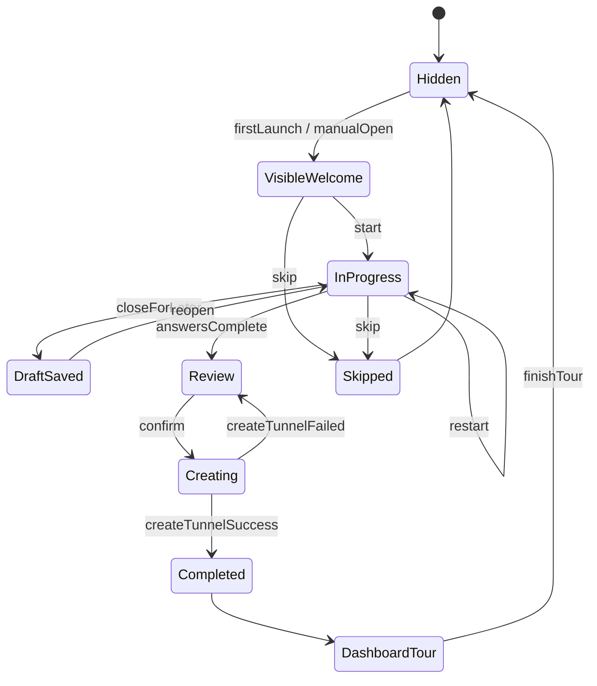
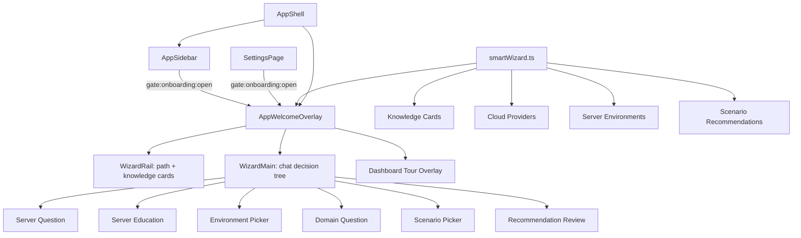

# Gate Smart Onboarding Wizard

目标：让完全不了解内网穿透的新用户，在 3-5 分钟内通过“像聊天一样配置”的方式生成第一个 Tunnel。当前阶段只改前端体验层，不新增 Tunnel 能力，不改 Runtime、HTTP/HTTPS、Domain。

## 完整交互流程

1. 首次启动时进入 Welcome Wizard，不直接进入 Dashboard。
2. 欢迎页说明 Gate 用途、预计时间、可跳过，并支持“以后不再显示”。
3. 第一问：你已经拥有公网服务器了吗？
4. 如果没有服务器或不知道公网服务器，进入概念解释与云厂商推荐页，并展示“一键部署预留”。
5. 如果已有服务器，继续询问服务器环境：Ubuntu、Debian、CentOS、Windows Server、Docker、宝塔、1Panel、CasaOS、Unraid、Synology 预留。
6. 询问是否拥有域名：有、没有、暂时不用。没有域名时解释 IP + Port 也能使用。
7. 询问使用场景：支付回调、Webhook、SpringBoot、Vue 开发、Node、Python、MCP Server、AI Agent、SSH、MySQL、PostgreSQL、Redis、NAS、Minecraft、Docker、自定义。
8. 根据回答生成推荐配置：Server、Protocol、Local、Remote、Domain、Certificate、访问预览。
9. 展示“为什么推荐这样配置？”，解释协议、端口、域名和证书选择。
10. 用户确认后创建第一个 Tunnel，自动跳转 Dashboard。
11. Dashboard 上依次高亮 Dashboard、Tunnel、Log、Settings，让用户知道主要页面作用。
12. 用户跳过则直接进入 Dashboard；侧栏和 Settings 保留“重新打开新手引导”入口。
13. 用户随时关闭时会保存草稿；再次打开可继续，也可选择重新开始。

## Mermaid 决策树

## 页面流程图

## 状态流转图

## 组件结构图

## 实现说明

- 推荐规则在 `client/src/onboarding/smartWizard.ts`，便于后续扩展一键部署或更多场景。
- Welcome Wizard 在 `client/src/shell/AppWelcomeOverlay.vue`，使用动态 screen + answer state，而不是固定 Step。
- 草稿、完成状态和“不再显示”使用 localStorage：
  - `gate.smartOnboarding.completed`
  - `gate.smartOnboarding.neverShow`
  - `gate.smartOnboarding.draft`
- 重新打开入口通过 `gate:onboarding:open` 浏览器事件触发。
- 创建 Tunnel 复用现有 `useTunnelStore().createTunnel()`，不改变 Runtime 和协议实现。
