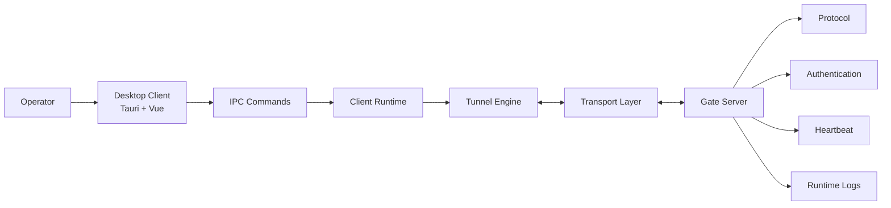
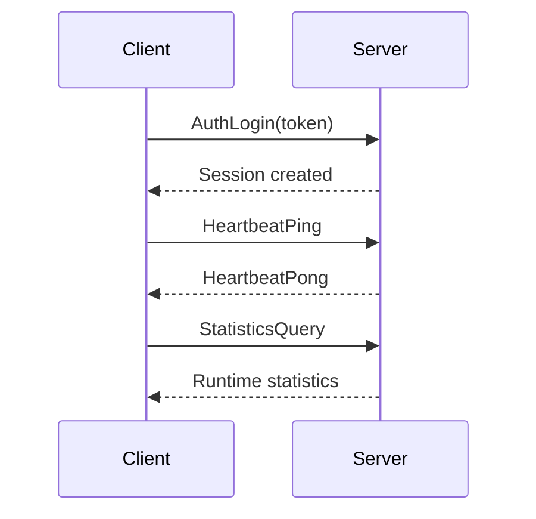

# Architecture

Gate is organized as a Rust-first workspace with a desktop client and self-hosted server.

## High-Level View

## Workspace Layout

| Path | Role |
| --- | --- |
| `client` | Tauri desktop app and Vue UI |
| `server` | Server bootstrap crate |
| `shared` | Shared errors, lifecycle, logging, config, and utilities |
| `crates/domain` | Domain entities, repositories, services, and handlers |
| `crates/application` | Application commands, queries, dispatchers, and use cases |
| `crates/engine` | Tunnel runtime, state, heartbeat, forwarding, and monitoring foundations |
| `crates/infrastructure` | Storage, logger, cache, network, runtime, and scheduler infrastructure |
| `crates/protocol` | Message, packet, codec, command, event, and version model |
| `crates/communication` | Client/server communication primitives |
| `crates/transport` | TCP, HTTP, IPC, and WebSocket transport shells |
| `integration` | Cross-crate integration tests |

## Runtime Sequence

## Design Principles

- Keep protocol, transport, runtime, and UI concerns separate.
- Keep examples small and copyable.
- Prefer explicit alpha limitations over vague promises.
- Document every public configuration variable.
- Treat screenshots, release notes, and troubleshooting as part of the product.

## Deep Dives

- `docs/runtime`
- `docs/communication`
- `docs/tunnel-engine`
- `docs/heartbeat-reconnect`
- `docs/ADR`
