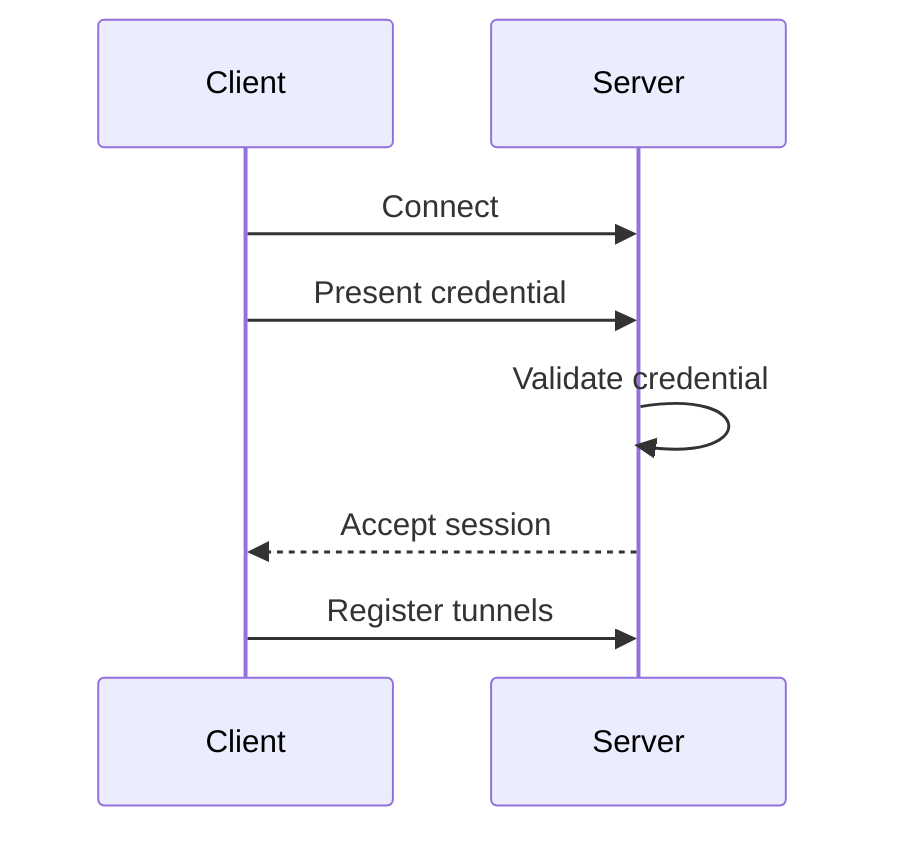

# Authentication

Gate authenticates runtime sessions before accepting tunnel registration or traffic forwarding.

## Goals

- Prevent unauthenticated tunnel access.
- Keep token handling explicit.
- Support local development without weakening production defaults.
- Provide clear future migration paths for enterprise identity integrations.

## Recommended Production Baseline

| Control | Recommendation |
| --- | --- |
| Token storage | Store outside repository and images |
| Rotation | Rotate on release, operator change, or incident |
| Transport | Use TLS at the edge or native TLS when enabled |
| Logging | Never log raw tokens |
| Access | Limit server bind and exposed ports |

## Session Flow

## Reserved

SSO, OAuth/OIDC, scoped tokens, and enterprise RBAC are reserved for future versions.
