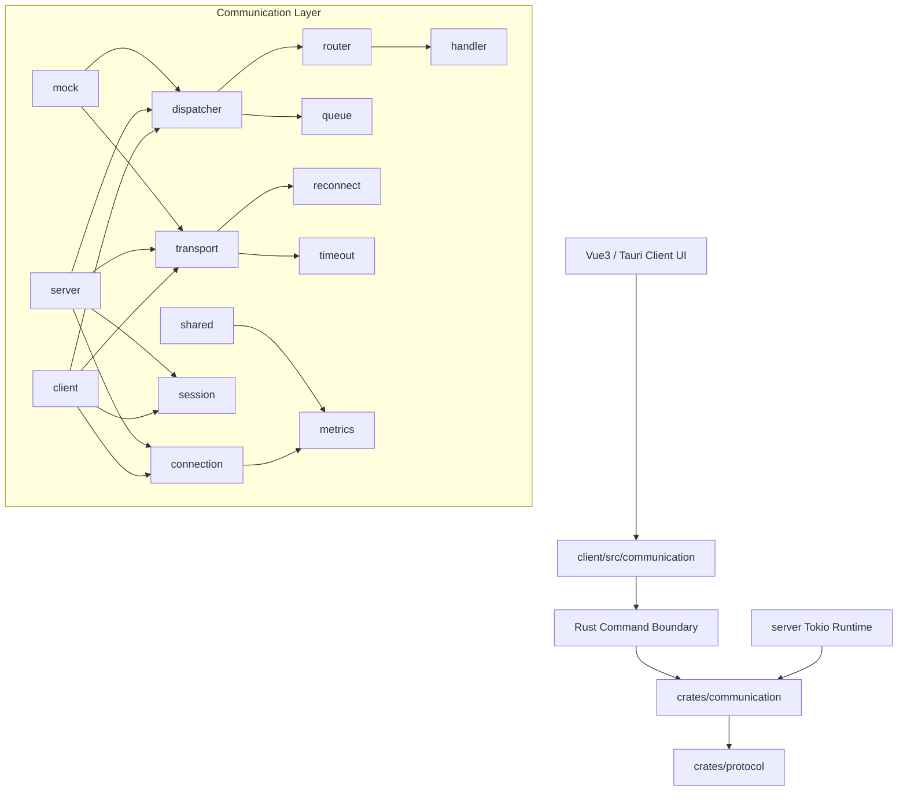
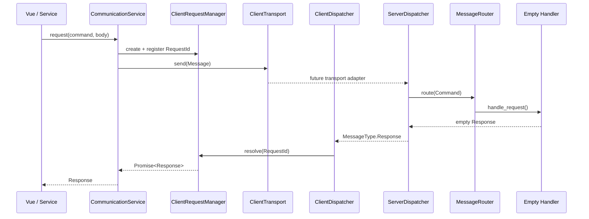
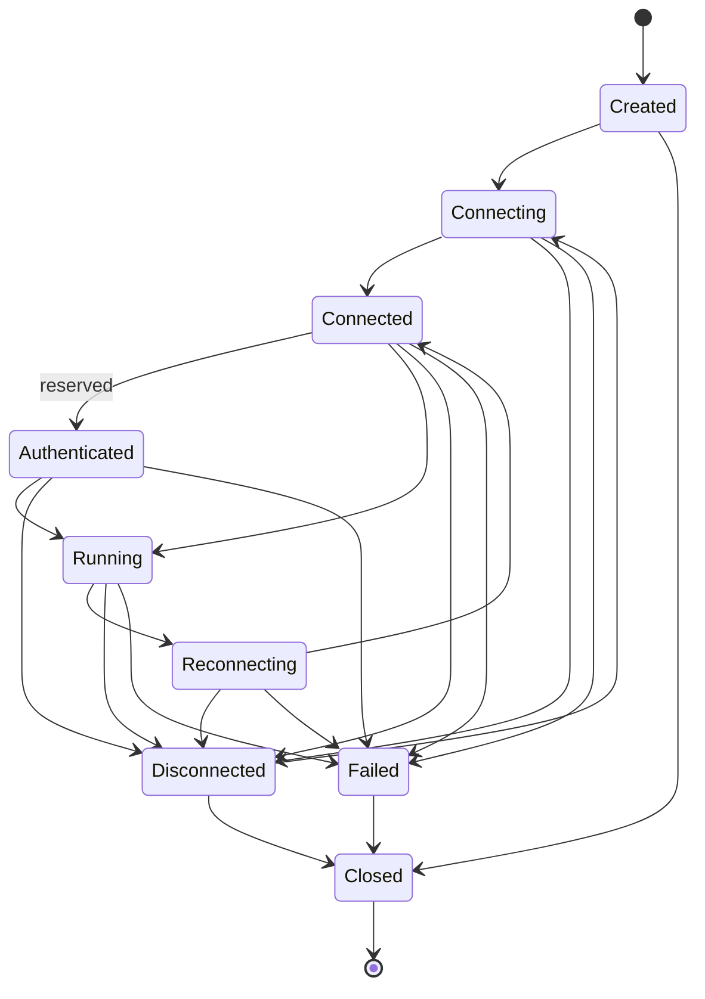

# Communication Architecture

The Communication Layer is the infrastructure boundary between Gate clients and Gate servers. It owns connection lifecycle, transport abstraction, message routing, request/response correlation, event distribution, session context, retry policy, timeout policy, logging, metrics, and mocks.

It does not implement Tunnel, authentication, heartbeat loops, business workflows, or real network IO.

## Module Graph

## Request Sequence

## Lifecycle

## Naming Rules

- Rust crate: `gate-communication`.
- Rust modules: singular nouns for concepts, role modules for `client` and `server`.
- Rust traits: capability nouns, for example `Transport`, `Dispatcher`, `Connection`, `Session`, `RequestHandler`, `ResponseHandler`, `EventHandler`.
- Rust structs: role-prefixed when role-specific, for example `ClientTransport`, `ServerConnection`, `ClientRequestManager`.
- TypeScript interfaces: domain nouns, for example `Connection`, `Request`, `Response`, `Message`, `Event`, `Session`, `Transport`.
- TypeScript classes: role-prefixed service objects, for example `CommunicationService`, `ClientDispatcher`, `MockTransport`.
- Commands: dotted protocol commands from `gate-protocol`, for example `project.create`, `server.status`, `system.health`.
- States: lowercase strings in TypeScript, PascalCase enum variants in Rust.
