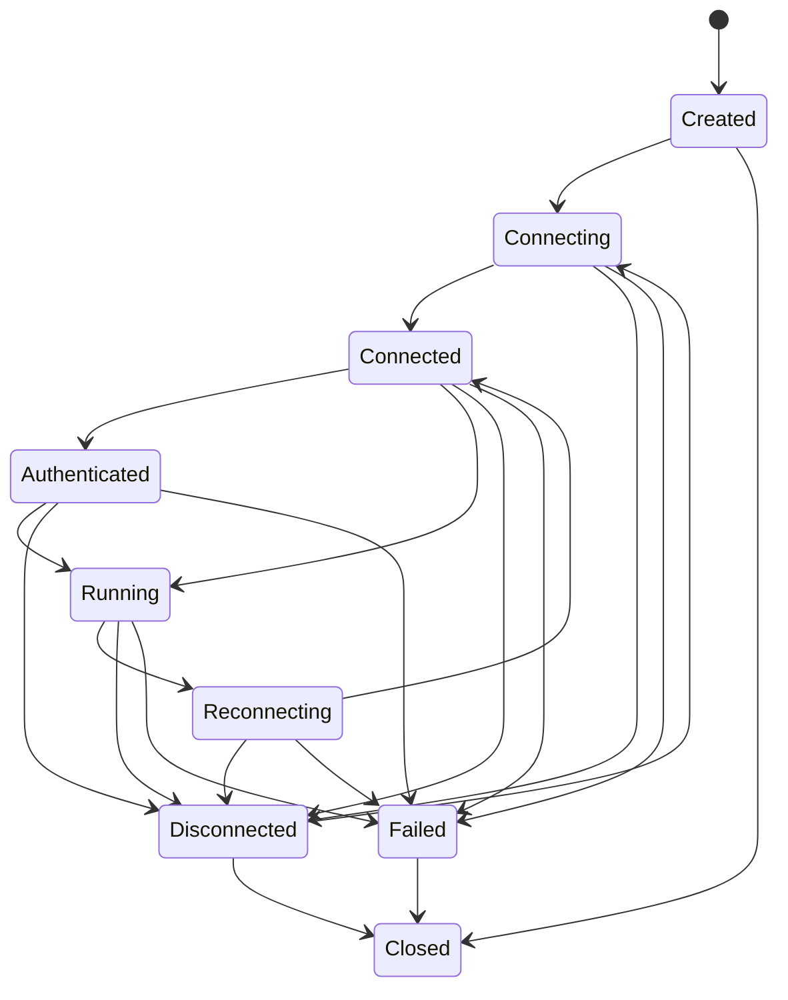

# Connection

Connection owns identity, context, metadata, statistics counters, and lifecycle state.

## Core Types

- `ConnectionId`
- `ConnectionContext`
- `ConnectionState`
- `ConnectionMetadata`
- `ConnectionStatistics`
- `Connection`
- `BasicConnection`

## States

`Authenticated` is reserved. The current layer only defines the state and legal transition; it does not perform authentication.

## Statistics

The connection statistics object tracks:

- Connected count.
- Reconnect count.
- Failed count.
- Send count.
- Receive count.
- Average latency in milliseconds.

These counters are communication diagnostics only. Business statistics remain outside this layer.
