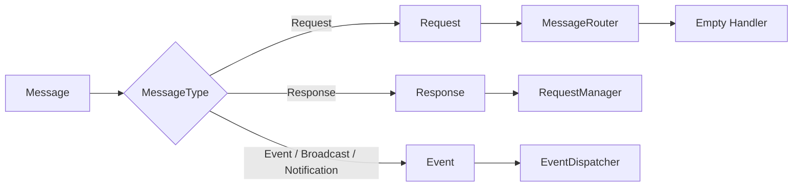

# Dispatcher

Dispatcher turns protocol messages into framework actions.

## Responsibilities

- Dispatch request messages by command.
- Dispatch response messages by request id.
- Dispatch events to subscribers.
- Register and remove command handlers.
- Keep Project, Tunnel, Server, System, and Log handlers empty until business layers are implemented.

## Command Routing

## Empty Handlers

- `ProjectHandler`
- `TunnelHandler`
- `ServerHandler`
- `SystemHandler`
- `LogHandler`

Each handler returns an empty framework response today. Real business behavior should be added in later business modules, not inside the communication foundation.
