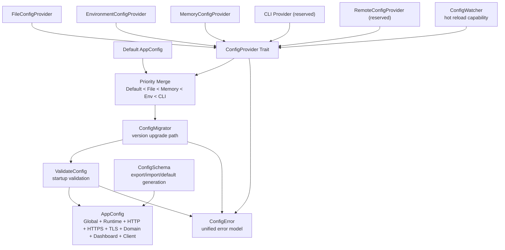

# Config Center

The Config Center is the unified configuration boundary for Gate. It is hosted
in `gate-shared` so runtime, TLS, domain, server, and client code can depend on
the same schema without making the shared kernel depend on business or runtime
crates.

This layer does not change runtime behavior. It provides the model, loading
pipeline, validation, schema, watcher, migration hooks, and error model that
future integration points can adopt.

## Config Inventory

| Name | Location | Purpose | Duplicates / Overlap | Dependencies |
| --- | --- | --- | --- | --- |
| `shared::config::AppConfig` | `shared/src/config.rs` | Unified root config for global, runtime, HTTP, HTTPS, TLS, domain, dashboard, client, logging, health | Supersedes the old thin shared app config | `LoggingConfig`, `HealthConfig` |
| `shared::config::RuntimeConfig` | `shared/src/config.rs` | Unified runtime defaults and limits | Name overlaps engine runtime config and engine core config | none |
| `shared::logging::LoggingConfig` | `shared/src/logging.rs` | Shared logging level/output/format | Unique, included by unified root | `ConfigError`, `tracing` |
| `shared::health::HealthConfig` | `shared/src/health.rs` | Shared health target selection | Overlaps `gate-engine::HealthConfig` by name, not by fields | `AppError` |
| `gate-engine::config::EngineConfig` | `crates/engine/src/core/config.rs` | Engine-level max tunnel/runtime/heartbeat labels | Partly overlaps unified runtime and health layers | `RuntimeConfig`, `HeartbeatConfig` |
| `gate-engine::config::TunnelConfig` | `crates/engine/src/config/mod.rs` | Tunnel identity, protocol, forward, heartbeat | Runtime-facing business config, not replaced | `ProtocolConfig`, `ForwardConfig`, `HeartbeatConfig` |
| `gate-engine::config::ProtocolConfig` | `crates/engine/src/config/mod.rs` | Tunnel bind/target protocol settings | Overlaps examples `gate.toml` protocol keys | `ProtocolKind` |
| `gate-engine::config::ForwardConfig` | `crates/engine/src/config/mod.rs` | Buffering/compression/encryption flags | Overlaps runtime buffer size | none |
| `gate-engine::config::RuntimeConfig` | `crates/engine/src/config/mod.rs` | Engine-level runtime worker/task/shutdown settings | Same name as shared/runtime runtime configs | none |
| `gate-engine::config::HeartbeatConfig` | `crates/engine/src/config/mod.rs` | Engine heartbeat scheduling and retry | Overlaps protocol heartbeat and client stability heartbeat | none |
| `gate-engine::config::ReconnectConfig` | `crates/engine/src/config/mod.rs` | Reconnect strategy and recovery scope | Overlaps client stability reconnect defaults | `ReconnectStrategyConfig` |
| `gate-engine::config::HealthConfig` | `crates/engine/src/config/mod.rs` | Engine health score and offline thresholds | Same name as shared health config | none |
| `gate-engine::config::SyncConfig` | `crates/engine/src/config/mod.rs` | State sync inclusion and batch policy | Overlaps client stability sync config | none |
| `gate-engine::runtime::ListenerConfig` | `crates/engine/src/runtime/config.rs` | TCP listener socket and accept limits | Covered by unified runtime/http/https layers | `TunnelId`, `SocketAddr` |
| `gate-engine::runtime::ConnectorConfig` | `crates/engine/src/runtime/config.rs` | TCP target socket and keepalive | Covered by tunnel/runtime adapters later | `SocketAddr` |
| `gate-engine::runtime::BufferConfig` | `crates/engine/src/runtime/config.rs` | Runtime buffer pool sizing | Overlaps `ForwardConfig.buffer_size` | none |
| `gate-engine::runtime::RetryConfig` | `crates/engine/src/runtime/config.rs` | Runtime retry/backoff | Overlaps reconnect config | `BackoffStrategy` |
| `gate-engine::runtime::TimeoutConfig` | `crates/engine/src/runtime/config.rs` | Runtime read/write/idle/connect/shutdown timeout | Overlaps communication timeout config | none |
| `gate-engine::runtime::RuntimeConfig` | `crates/engine/src/runtime/config.rs` | Concrete TCP runtime config | Same name as shared and engine config runtime | listener/connector/buffer/retry/timeout |
| `gate-engine::runtime::HttpRuntimeConfig` | `crates/engine/src/runtime/http/mod.rs` | HTTP runtime base/routes/header/log settings | Covered by unified HTTP layer | `RuntimeConfig`, `HttpRouteConfig` |
| `gate-engine::runtime::HttpHeaderConfig` | `crates/engine/src/runtime/http/mod.rs` | Request/response header mutation | HTTP-only detail | `HttpHeaderRule` |
| `gate-engine::runtime::HttpRouteConfig` | `crates/engine/src/runtime/http/mod.rs` | HTTP host/path route to target service | Route schema belongs below unified HTTP layer | `TunnelId`, `SocketAddr`, `HttpHeaderConfig` |
| `gate-engine::runtime::HttpsTlsConfig` | `crates/engine/src/runtime/https.rs` | HTTPS listener TLS options | Overlaps server TLS config | `TlsProtocolVersion` |
| `gate-engine::runtime::HttpsRuntimeConfig` | `crates/engine/src/runtime/https.rs` | HTTPS runtime with injected cert provider/resolver | Depends on runtime services, not centralized directly | `HttpRuntimeConfig`, `HttpsTlsConfig`, providers |
| `gate-engine::runtime::WatchdogConfig` | `crates/engine/src/runtime/reliability/watchdog.rs` | Runtime reliability watchdog thresholds | Runtime reliability sub-layer | reliability metrics |
| `gate-engine::runtime::SupervisorConfig` | `crates/engine/src/runtime/reliability/supervisor.rs` | Runtime restart/circuit-breaker policy | Runtime reliability sub-layer | `CircuitBreakerConfig` |
| `gate-server-tls::TlsConfig` | `server/tls/src/config.rs` | TLS enablement, cert paths, ACME challenge defaults | Covered by unified TLS layer | `ChallengeType` |
| `gate-server-tls::CertificateStoreConfig` | `server/cert_store/src/store.rs` | Certificate backend paths/URLs | Covered by unified TLS store path and future storage layer | `StoreBackend` |
| `gate-server-tls::RenewConfig` | `server/renew/src/scheduler.rs` | Certificate renewal interval/window | Covered by unified TLS renewal fields | certificate model |
| `server::domain::DomainConfig` | `server/domain/config/mod.rs` | Domain validation/storage/reservation policy | Covered by unified Domain layer | `ValidationMode`, `StorageKind` |
| `gate-domain::statistics::StatisticsConfig` | `crates/domain/src/modules/statistics/config/mod.rs` | Statistics collector/sampling/dashboard/alert root | Dashboard fields overlap unified Dashboard layer | collector/sampling/dashboard/alert configs |
| `gate-domain::statistics::DashboardConfig` | `crates/domain/src/modules/statistics/config/mod.rs` | Dashboard refresh and point counts | Same name as unified Dashboard config | none |
| `gate-communication::TimeoutConfig` | `crates/communication/src/timeout/mod.rs` | Request/heartbeat/connection/read/write timeouts in ms | Overlaps engine runtime timeout config | `TimeoutKind` |
| `gate-protocol::HeartbeatConfig` | `crates/protocol/src/message/heartbeat.rs` | Protocol heartbeat timing payload in ms | Overlaps engine heartbeat config | heartbeat newtypes |
| `gate-client::AppConfig` | `client/src-tauri/src/config/mod.rs` | Tauri client persisted preferences, currently TODO load/save | Covered by unified Client layer | `anyhow`, serde |
| `DefaultConfigurationService` | `client/src/services/ConfigurationService.ts` | Frontend configuration service with defaults/watchers | Client-side analogue to ConfigProvider/Watcher | storage, event bus |
| `AppConfiguration` | `client/src/services/ConfigurationService.ts` | Frontend appearance/locale/shortcut/window config | Covered by unified Client layer at coarse level | none |
| `Setting*` schema types | `client/src/views/settings/types/index.ts` | UI settings schema and validation metadata | Presentation schema, not runtime config | none |
| `AlphaServerConfig` | `integration/src/server.rs` | Integration protocol server fixture | Test-only duplicate of server bind/auth config | TCP listener |
| `RuntimeHarnessConfig` | `integration/src/runtime.rs` | Integration TCP runtime fixture | Test-only duplicate of runtime listener/target/timeouts | gate-engine runtime |

## Unified Layers

| Layer | Owner | Contains |
| --- | --- | --- |
| Global Config | `shared::config::GlobalConfig` | app name, environment, instance id, data/log roots |
| Runtime Config | `shared::config::RuntimeConfig` | workers, limits, shutdown, monitor/cleanup cadence, TCP defaults |
| HTTP Config | `shared::config::HttpConfig` | HTTP listener defaults, header/log/route limits |
| HTTPS Config | `shared::config::HttpsConfig` | HTTPS listener defaults, redirect, TLS version, HSTS/OCSP, cert domains |
| TLS Config | `shared::config::TlsConfig` | cert/key paths, renewal, ACME challenge, DNS provider, certificate store |
| Domain Config | `shared::config::DomainConfig` | validation mode, reservations, storage kind, DNS check defaults |
| Dashboard Config | `shared::config::DashboardConfig` | refresh interval, retained points, recent log limit |
| Client Config | `shared::config::ClientConfig` | desktop server address/token, theme, language, tray/autoconnect |

## Loading Pipeline

Precedence is:

```text
Default < File < Memory < Environment < CLI
```

`RemoteConfigProvider` is intentionally reserved and returns a typed
`ConfigError::RemoteReserved` until remote configuration is designed.

## Config Architecture



## Integration Rule

Runtime crates keep their existing config structs. The Config Center owns
cross-cutting config IO, validation, migration, and schema. Future integration
should add adapter code at application/bootstrap boundaries instead of changing
runtime internals.
