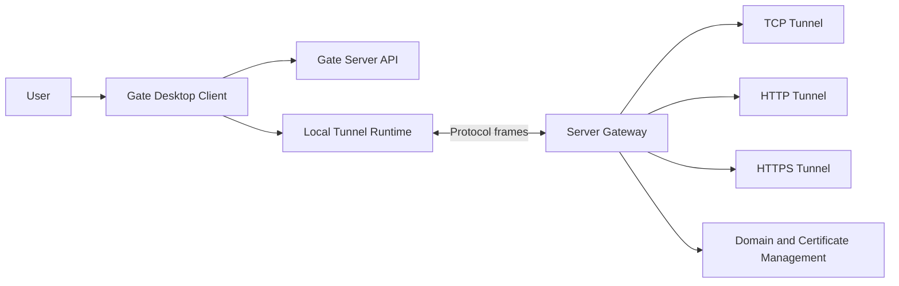

# Architecture

Gate is a self-hosted tunnel platform built around a Rust server, a Tauri desktop client, and shared protocol/runtime crates.

## Repository map

| Path | Purpose |
| --- | --- |
| `client/` | Vue + Tauri desktop client. |
| `server/` | Gate server entrypoint and gateway integration. |
| `server/tls/` | Certificate, ACME, and renewal infrastructure. |
| `crates/protocol/` | Protocol types and codec boundaries. |
| `crates/engine/` | Tunnel runtime implementation. |
| `crates/communication/` | Communication and transport coordination. |
| `shared/` | Shared configuration, errors, lifecycle, and utilities. |
| `integration/` | Integration test crate. |
| `docker/` | Server container assets. |
| `.github/workflows/` | CI, security, docs, and release automation. |

## Release cleanup boundaries

The v0.9 release cleanup intentionally avoids functional changes to:

- Tunnel data plane.
- TCP, HTTP, and HTTPS runtime behavior.
- Communication protocol behavior.
- Database structure.
- Business logic.

Release work is limited to documentation, packaging, CI/CD, versioning, and resource cleanup.

## Design principles

- Keep release engineering simple and reproducible.
- Prefer explicit scripts over hidden local assumptions.
- Make user documentation short and task-oriented.
- Keep internal runtime details outside the first-run path.
