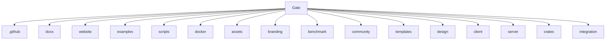
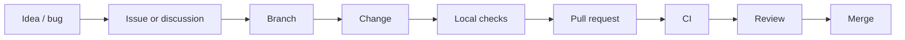
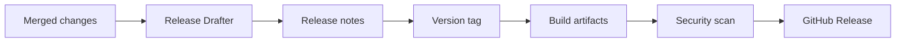

# Diagrams

## Repository Structure

```mermaid
flowchart TD
  Root["Gate"] --> Github[".github"]
  Root --> Docs["docs"]
  Root --> Website["website"]
  Root --> Examples["examples"]
  Root --> Scripts["scripts"]
  Root --> Docker["docker"]
  Root --> Assets["assets"]
  Root --> Branding["branding"]
  Root --> Benchmark["benchmark"]
  Root --> Community["community"]
  Root --> Templates["templates"]
  Root --> Design["design"]
  Root --> Client["client"]
  Root --> Server["server"]
  Root --> Crates["crates"]
  Root --> Integration["integration"]
```

## Contribution Flow

```mermaid
flowchart LR
  Idea["Idea / bug"] --> Issue["Issue or discussion"]
  Issue --> Branch["Branch"]
  Branch --> Change["Change"]
  Change --> Checks["Local checks"]
  Checks --> PR["Pull request"]
  PR --> CI["CI"]
  CI --> Review["Review"]
  Review --> Merge["Merge"]
```

## Release Flow

```mermaid
flowchart LR
  Merge["Merged changes"] --> Draft["Release Drafter"]
  Draft --> Notes["Release notes"]
  Notes --> Tag["Version tag"]
  Tag --> Build["Build artifacts"]
  Build --> Scan["Security scan"]
  Scan --> Publish["GitHub Release"]
```
