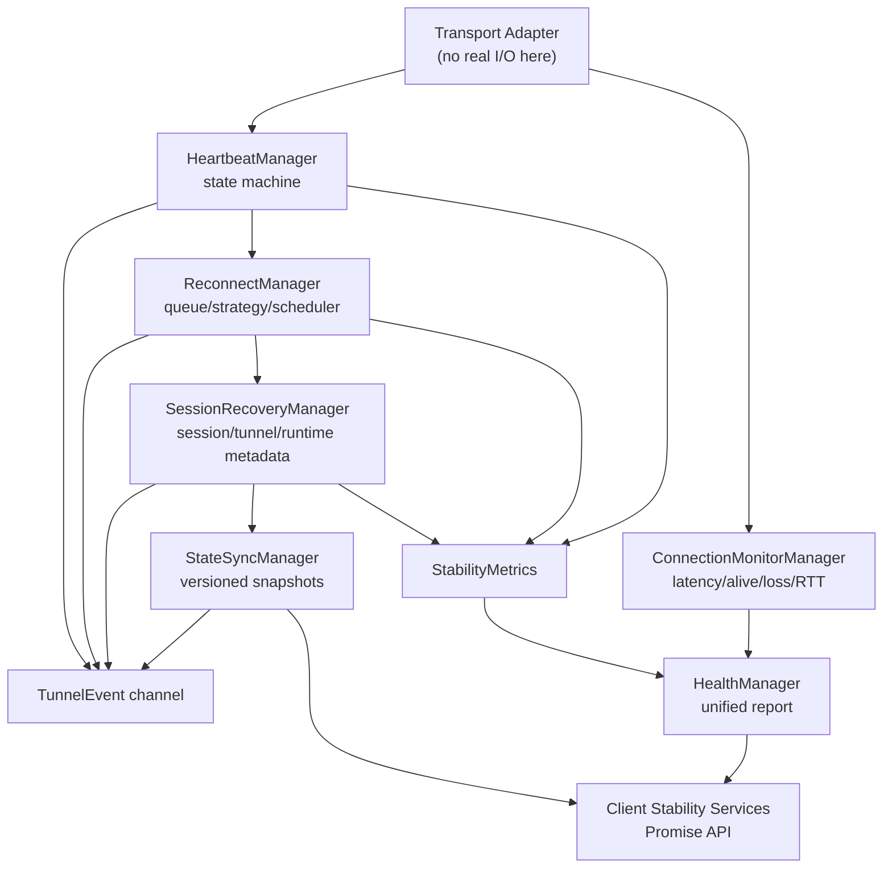

# Heartbeat & Reconnect Architecture

Heartbeat & Reconnect 是 Gate 的稳定性核心，负责连接可用性检测、自动重连、Session/Tunnel 运行态恢复、状态同步和健康汇总。该层不实现真实网络通信、不恢复业务数据、不访问数据库。

## Module Directory

```text
crates/engine/src/
  heartbeat/
  reconnect/
  session_recovery/
  connection_monitor/
  state_sync/
  health/
  mock/

client/src/stability/
  types.ts
  services.ts
  mock.ts

crates/engine/tests/
  heartbeat/
  reconnect/
  mock/
  integration/
  fixtures/
```

## Architecture



## Event Contract

统一事件由 `TunnelEvent` 输出：

- `HeartbeatStarted`
- `HeartbeatStopped`
- `HeartbeatTimeout`
- `ReconnectStarted`
- `ReconnectSucceeded`
- `ReconnectFailed`
- `SessionRecovered`
- `ConnectionLost`
- `ConnectionRestored`
- `StateSynchronized`

## Scaling Notes

- Rust 侧使用 `DashMap` 按连接或 Tunnel 分片存储状态，避免百万级连接下的全局锁。
- Manager 只保存运行态快照和指标，不保存业务 payload。
- Reconnect queue 有容量上限，避免故障风暴导致无限内存增长。
- 状态同步使用版本号，后续接入远端同步时可做冲突检测。
- 健康检查只聚合信号，不主动探测网络，避免和 transport 层耦合。
