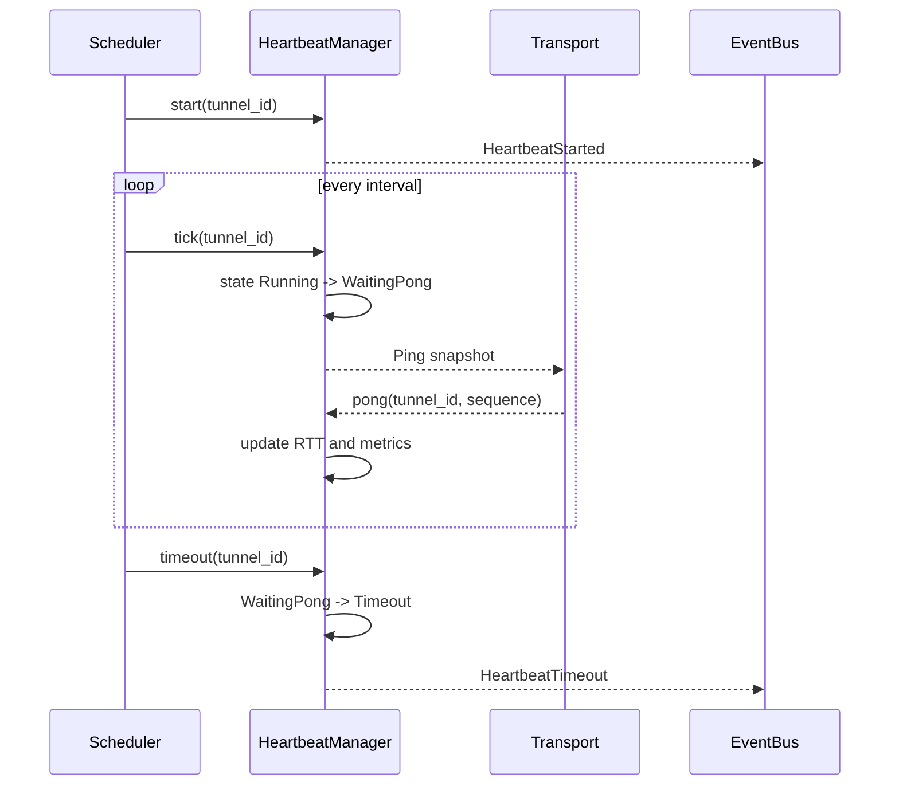

# Heartbeat

`HeartbeatManager` 是异步心跳状态机，支持 `Start`、`Stop`、`Pause`、`Resume`、`Tick`、`Ping`、`Pong`、`Timeout`。

## State

```text
Idle -> Running -> WaitingPong -> Running
WaitingPong -> Timeout -> Retrying -> WaitingPong
Running/WaitingPong/Timeout/Retrying -> Stopped
Running -> Idle -> Running
```

## Config

`HeartbeatConfig` 支持 Builder Pattern：

- `interval`
- `timeout`
- `retry_count`
- `retry_delay`
- `max_missed_heartbeat`

## Sequence



## Metrics

心跳指标包括：

- `ping_count`
- `pong_count`
- `timeout_count`
- `retry_count`
- `heartbeat_count`
- `average_rtt_ms`
- `last_rtt_ms`

## Boundary

`HeartbeatManager` 不发送真实 ping 包。真实 transport 应在发送前调用 `ping()`，收到 pong 后调用 `pong()`。
