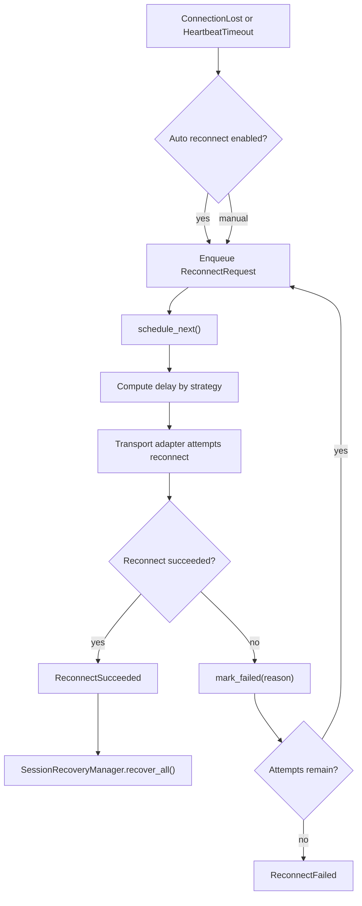

# Reconnect

`ReconnectManager` 提供自动重连、手动重连、重连队列、策略计算和调度快照。它不执行真实拨号，只产出下一次尝试的 `ReconnectRequest`。

## Strategy

支持策略：

- `Immediate`
- `Linear`
- `ExponentialBackoff`
- `FixedInterval`
- `CustomReconnectStrategy`

策略统一实现 `ReconnectStrategy` trait。

## Flow

## Config

`ReconnectConfig` 支持 Builder Pattern：

- `auto_reconnect`
- `max_attempts`
- `queue_capacity`
- `strategy`
- `scheduler_tick`
- `recover_session`
- `recover_tunnel`
- `recover_statistics`
- `recover_context`
- `recover_subscription`

## Boundary

真实网络重连由 transport adapter 完成。adapter 成功后调用 `mark_succeeded()`，失败后调用 `mark_failed()`。
