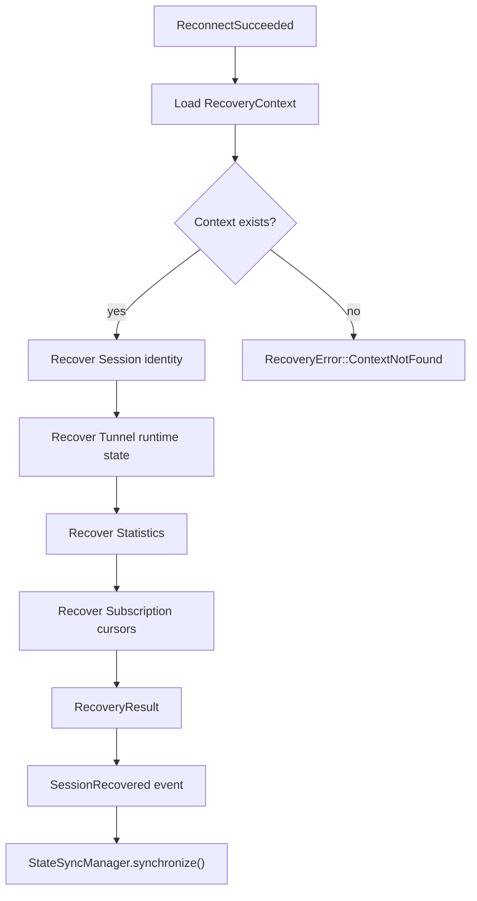

# Recovery

`SessionRecoveryManager` 只恢复运行态元数据，不恢复业务数据。

## Recoverable Scope

- Session identity
- Tunnel identity
- Runtime context attributes
- Subscription cursor
- Statistics

## Non-Recoverable Scope

- Business data
- Database state
- User payload
- External side effects

## Flow

## Result

`RecoveryResult` includes:

- `recovered_session`
- `recovered_tunnel`
- `recovered_statistics`
- `recovered_context`
- `recovered_subscription`
- `recovery_time_ms`
- `warnings`
