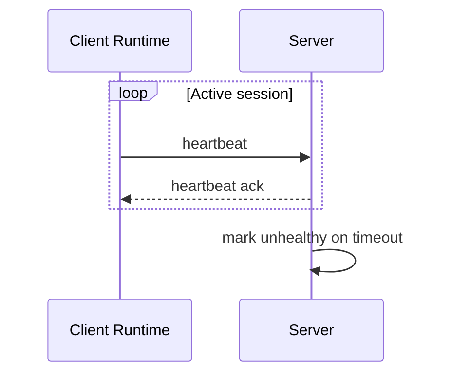

# Heartbeat

Heartbeat keeps client and server session state synchronized.

## Responsibilities

- Detect dead clients.
- Mark tunnel sessions unhealthy.
- Trigger reconnect flow.
- Feed monitoring metrics and troubleshooting views.

## Defaults

| Setting | Example |
| --- | --- |
| Interval | `30s` |
| Timeout | `90s` |
| Retry backoff | Exponential with jitter |

## Flow

## Troubleshooting

- Check network reachability between client and server.
- Check server logs for authentication or timeout errors.
- Compare heartbeat interval and timeout values with proxy idle timeout settings.
