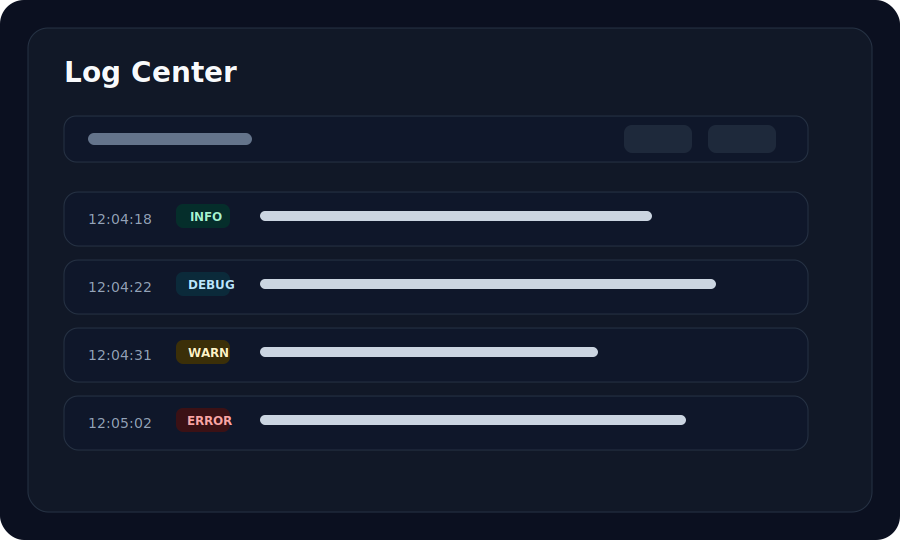

# Log Center

Log Center is the troubleshooting surface for Gate runtime events.

## What It Should Show

| Field | Description |
| --- | --- |
| Timestamp | Local event time |
| Level | Debug, info, warn, error, or success |
| Source | Server, client, tunnel, authentication, heartbeat, or transport |
| Message | Human-readable event summary |
| Context | Tunnel, project, server, session, request, or connection metadata |

## Common Filters

- Level.
- Source.
- Project.
- Tunnel.
- Server.
- Time range.
- Search keyword.

## Troubleshooting Flow

1. Reproduce the issue.
2. Open Log Center.
3. Filter by tunnel or server.
4. Switch level to warning and error.
5. Inspect the event context.
6. Export logs if opening an issue.

## Export Safety

Before sharing logs, remove:

- Tokens.
- Public IPs you do not want to expose.
- Customer identifiers.
- Private hostnames.
- Payment or webhook payload secrets.

## Screenshot

