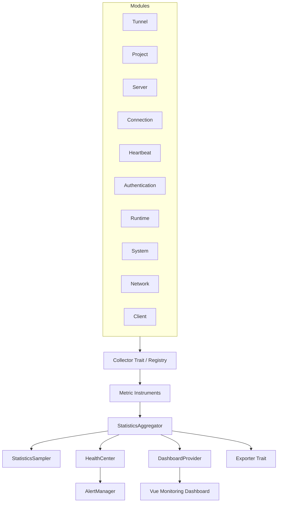

# Monitoring Center Architecture

Monitoring Center 是 Gate 的统一可观测性边界。本阶段只建立架构、契约、Mock 数据和 Dashboard，不连接数据库，不实现 Prometheus，不实现 OpenTelemetry。

## Modules

- `monitor`: 统一门面，组合 Collector、Aggregator、Sampler、HealthCenter、AlertManager。
- `statistics`: Tunnel、Server、Connection、Runtime、Heartbeat、Authentication、Project、System、Network、Client 的统计快照。
- `metrics`: Counter、Gauge、Histogram、Summary、Rate、Average、Peak、Min、Max 的统一指标接口。
- `collector`: 采集器 Trait、Registry 和 Mock Collector。
- `aggregator`: 实时、分钟、小时、天统计窗口，历史统计预留。
- `sampler`: 1s、5s、10s、30s、1min 采样策略。
- `dashboard`: Overview、Traffic、Realtime Speed、Tunnel Status、Server Status、System Health、Connection Trend、Traffic Trend DTO。
- `exporter`: JSON、CSV、Prometheus、OpenTelemetry 导出 Trait，其中 Prometheus 和 OpenTelemetry 仅预留。
- `alert`: CPU High、Memory High、Connection Lost、Heartbeat Timeout、Traffic Overflow 事件化预留。
- `health`: Healthy、Warning、Critical、Offline 统一健康状态。

## Architecture



## Naming

Metric 命名规范：

```text
gate.<scope>.<resource>.<measurement>[.<unit>]
```

示例：

- `gate.system.cpu.usage`
- `gate.system.memory.usage`
- `gate.connection.current`
- `gate.connection.rtt.average`
- `gate.runtime.tasks.running`
- `gate.traffic.download.bps`

Rust 模块使用 `PascalCase` 类型、`snake_case` 字段。TypeScript 使用 `PascalCase` Interface、`camelCase` 字段。
