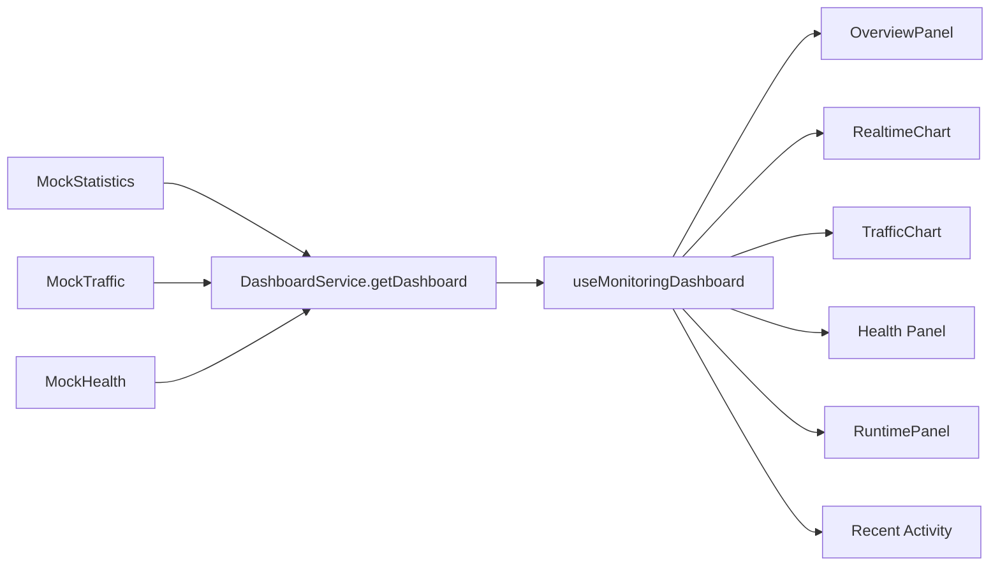

# Dashboard

Dashboard 读取统一 `DashboardData`，当前由 Mock 自动刷新。

## Provided Views

- Overview Card
- Traffic Card
- Realtime Chart
- Connection Chart
- Health Panel
- Tunnel List
- Runtime Status
- Recent Activity

## Vue Components

- `StatisticsCard`
- `TrafficChart`
- `RealtimeChart`
- `HealthIndicator`
- `RuntimePanel`
- `TunnelStatistics`
- `ConnectionStatistics`
- `SystemStatistics`
- `OverviewPanel`
- `DashboardWidget`
- `MonitoringDashboard`

## Dashboard Data Flow

## Refresh Strategy

`MockDashboard` supports subscription and refreshes once per second. Future real APIs can implement the same Promise service interfaces:

- `StatisticsService`
- `MetricsService`
- `HealthService`
- `DashboardService`
- `ExportService`
