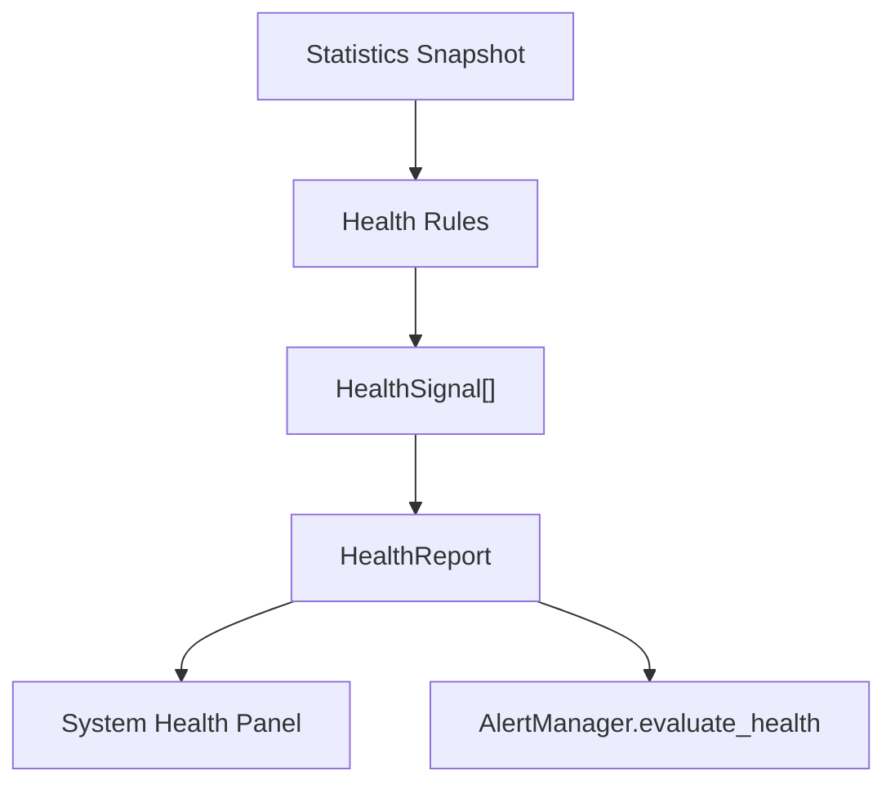

# Health

HealthCenter provides one unified health report for Gate modules.

## Status

- `Healthy`
- `Warning`
- `Critical`
- `Offline`

## Targets

- Tunnel
- Connection
- Runtime
- Heartbeat
- Server
- System

## Flow

Health is intentionally local and in-memory in this phase. Persistence, distributed health quorum, and external incident channels are future work.
