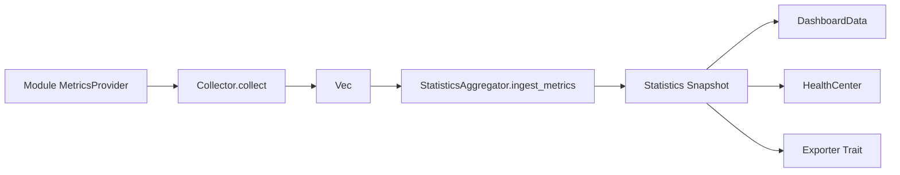

# Metrics

指标体系位于 `crates/domain/src/modules/statistics/metrics` 和 `client/src/monitoring/types`。

## Metric Kinds

- `Counter`: 单调递增计数。
- `Gauge`: 当前值。
- `Histogram`: 分布采样。
- `Summary`: 分位数统计预留。
- `Rate`: 单位时间速率。
- `Average`: 平均值。
- `Peak`: 峰值。
- `Min`: 最小值。
- `Max`: 最大值。

## Metrics Flow

## Rust Contracts

Rust exposes:

- `MetricInstrument`
- `MetricsProvider`
- `CounterMetric`
- `GaugeMetric`
- `HistogramMetric`
- `SummaryMetric`
- `RateMetric`
- `AverageMetric`
- `PeakMetric`
- `MinMetric`
- `MaxMetric`

## TypeDoc Contracts

TypeScript exposes:

- `Metric`
- `MetricKind`
- `MetricScope`
- `MetricLabel`

All current data is generated by `MockMetrics`; real providers can replace it without changing Dashboard components.
