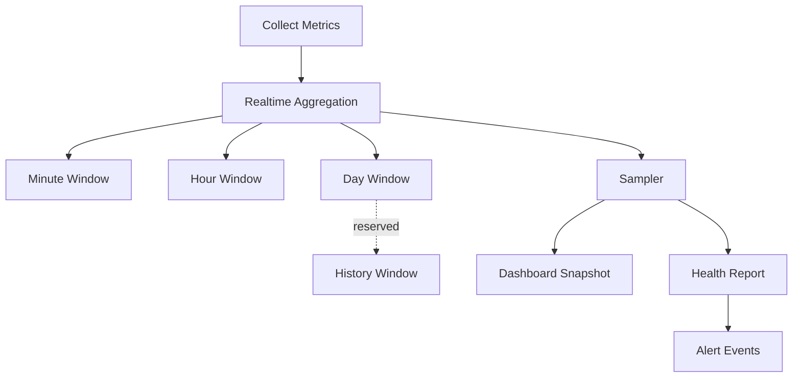

# Statistics

Statistics 是 Dashboard、Health、Alert、Export 的统一数据源。当前只使用 Mock，不接数据库。

## Snapshot Scope

- Tunnel
- Server
- Connection
- Runtime
- Heartbeat
- Authentication
- Project
- System
- Network
- Client

## Statistics Pipeline

## Main Rust Types

- `Statistics`
- `TrafficStatistics`
- `TunnelStatistics`
- `ConnectionStatistics`
- `RuntimeStatistics`
- `SystemStatistics`
- `ClientStatistics`

## Main TypeScript Interfaces

- `Statistics`
- `TrafficStatistics`
- `ConnectionStatistics`
- `RuntimeStatistics`
- `SystemStatistics`
- `ClientStatistics`
