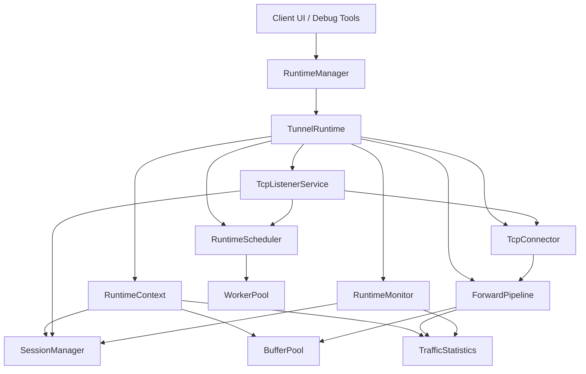
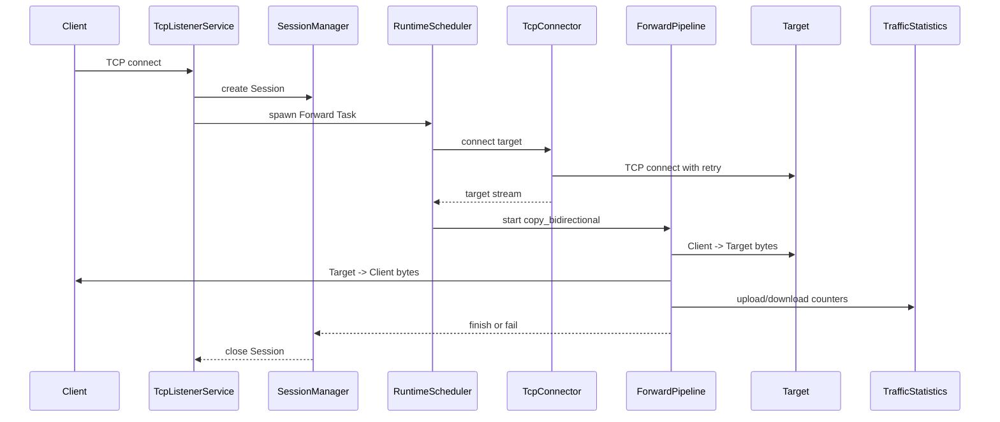
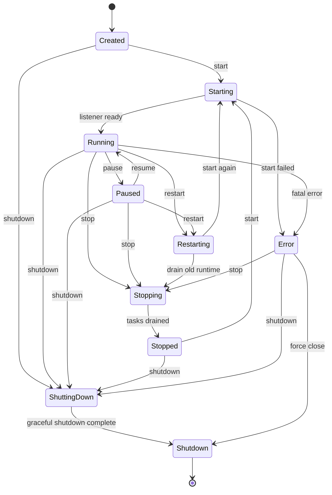
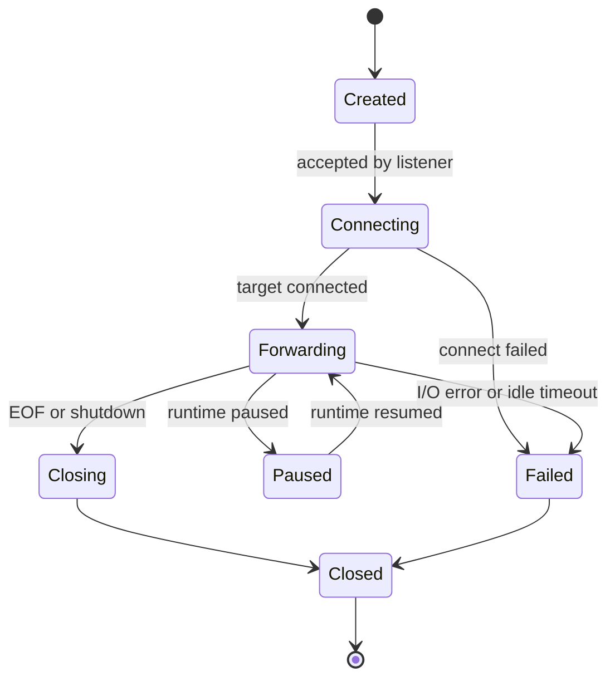

# Tunnel Runtime Architecture

Tunnel Runtime is the V1 TCP data-plane runtime for Gate. It is hosted in
`crates/engine/src/runtime` and is intentionally separated from protocol,
communication, and UI layers.

V1 supports TCP only. HTTP, HTTPS, UDP, P2P, custom copy loops, io_uring, and
mio are extension points, not V1 behavior.

## Module Layout

- `runtime`: public runtime facade and lifecycle.
- `listener`: TCP bind and accept service.
- `connector`: TCP target connector with timeout and retry.
- `forward`: bidirectional TCP forwarding pipeline.
- `session`: session identity, lifecycle, and registry.
- `buffer`: reusable buffer pool boundary.
- `stream`: stream wrappers and stream statistics hooks.
- `worker`: Tokio task registry.
- `scheduler`: centralized task scheduling API.
- `monitor`: traffic counters and runtime metrics.
- `mock`: debug mocks for client integration.

## Architecture

## Data Flow

## Runtime Lifecycle

## Session Lifecycle

## Naming Convention

- Runtime types use `Runtime*`: `RuntimeConfig`, `RuntimeContext`,
  `RuntimeState`, `RuntimeBuilder`, `RuntimeLifecycle`.
- TCP-specific implementations use `Tcp*`: `TcpListenerService`,
  `TcpConnector`.
- Protocol-neutral extension points use purpose names:
  `ForwardPipeline`, `BufferPool`, `SessionManager`, `RuntimeScheduler`.
- State enums use `*State`: `RuntimeState`, `SessionState`,
  `ConnectionState`, `ForwardState`.
- Errors use `*Error`: `RuntimeError`, `ListenerError`, `ConnectorError`,
  `ForwardError`, `BufferError`, `SchedulerError`.

## Coding Convention

- All Tokio tasks are spawned through `RuntimeScheduler`.
- Public structs, traits, and enums carry Rust doc comments.
- V1 data forwarding uses `tokio::io::copy_bidirectional`.
- Shared mutable runtime state uses `Arc`, `DashMap`, atomics, or small locks.
- Runtime shutdown is signaled through a `watch` channel and drained through
  `WorkerPool::graceful_shutdown`.
- Future HTTP, HTTPS, UDP, and P2P code should add new listener, connector,
  and forward implementations without changing the TCP public API.
