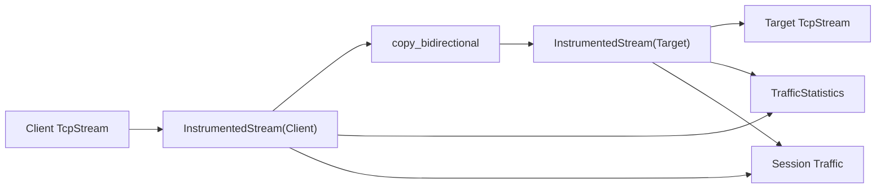

# Forward Pipeline

`ForwardPipeline` owns V1 TCP bidirectional forwarding.

## V1 Behavior

V1 uses:

```rust
tokio::io::copy_bidirectional()
```

The client stream and target stream are wrapped by `InstrumentedStream`, which
records upload and download counters while preserving the standard Tokio stream
contract.

Each forwarding session uses its own `ForwardStateMachine`. The pipeline-level
`state()` is a lightweight last-observed state for diagnostics, so concurrent
sessions do not share a mutable lifecycle machine.

## Flow



## Extension Points

- Replace `copy_bidirectional` with a custom pipeline when HTTP, HTTPS, UDP, or
  P2P requires framing or protocol-aware behavior.
- Attach `BufferPool` to the custom copy loop for buffer reuse.
- Add zero-copy paths behind the same `ForwardPipeline` interface.
- Keep traffic accounting in stream wrappers or pipeline stages.
