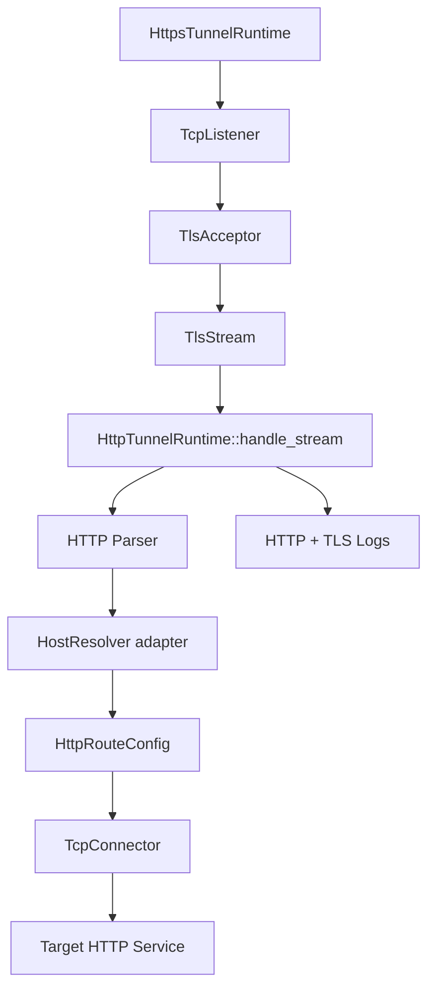
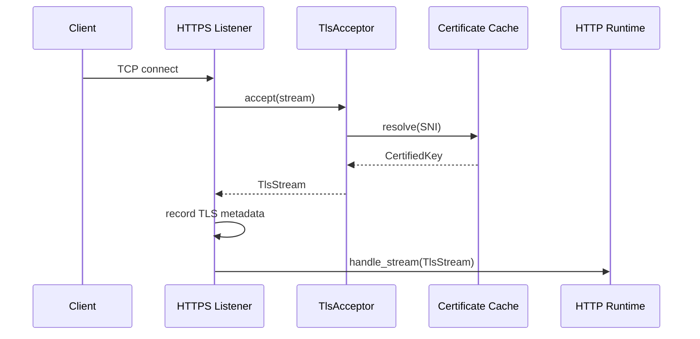
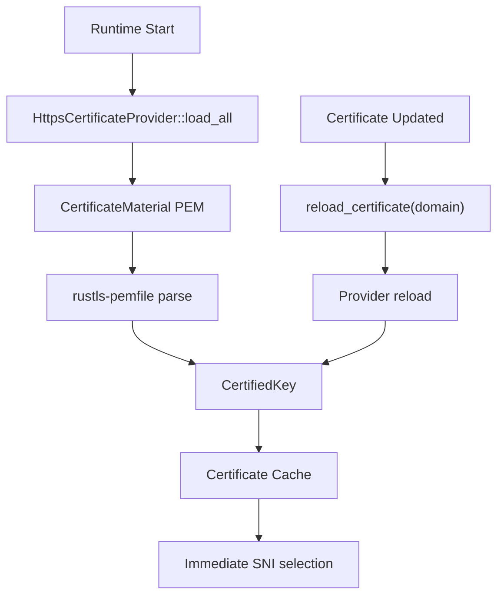
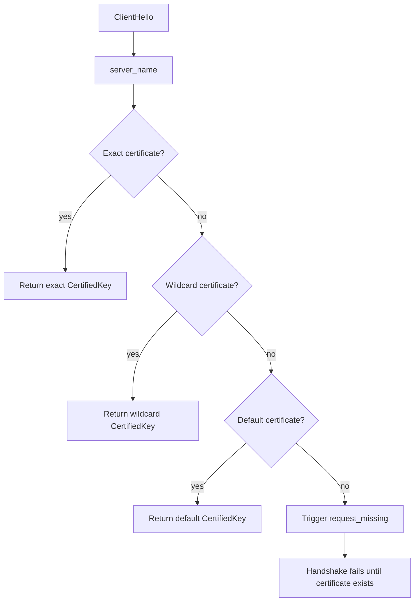
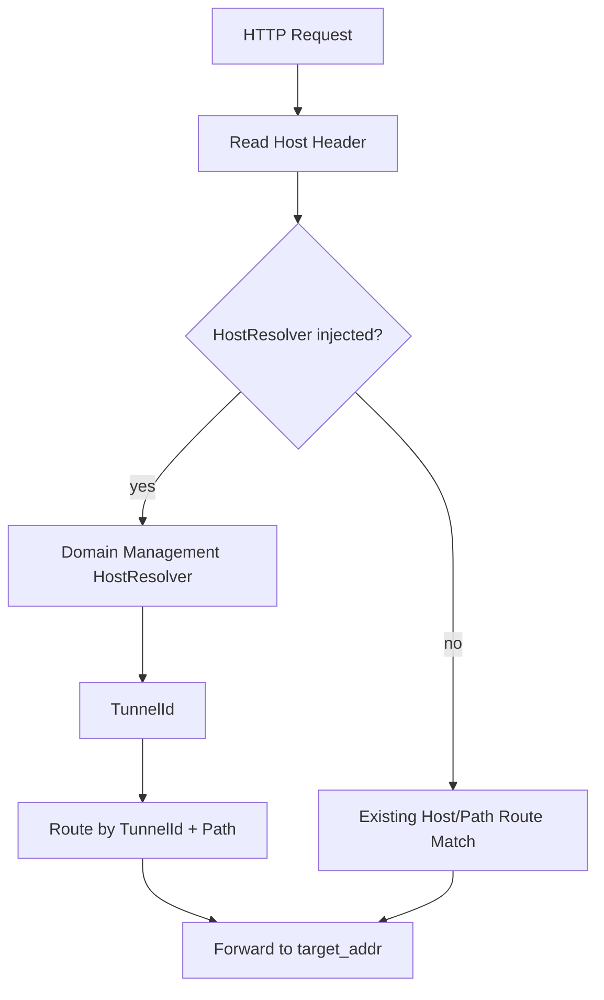

# HTTPS Runtime Integration

## Integration Plan

目标不是重新实现 HTTPS，而是在现有 HTTP Runtime 外侧增加 TLS listener，并复用现有 TLS Infrastructure、Domain Management 以及 HTTP request/forward/log pipeline。

### HTTP Runtime 需要增加的集成点

- `HttpTunnelRuntime::handle_stream`：从只接受 `TcpStream` 改为接受任意 `AsyncRead + AsyncWrite` stream。HTTPS handshake 后的 `TlsStream<TcpStream>` 直接进入这条路径。
- `HttpConnectionMetadata`：承载外部协议、TLS version、cipher suite、SNI、证书 fingerprint、handshake time、可选 HostResolver。
- `HttpHostResolver` adapter：HTTPS runtime 可注入 Domain Management 的 HostResolver。HTTP parser 读到 Host Header 后调用 resolver 获取 tunnel id，再选择已有 route。
- `HttpRequestLog`：增加 `http_version` 和可选 `tls` 字段。普通 HTTP 日志不带 TLS 字段，HTTPS 日志带 TLS 元数据。

### HTTP Runtime 保持不变的部分

- Request/response header parser。
- Host/path route 匹配的默认行为。
- TCP connector、retry、timeout、target forward。
- Keep-Alive、Content-Length、chunked body streaming。
- RuntimeContext、SessionManager、RuntimeScheduler、RuntimeMonitor。
- HTTP metrics aggregation。

## Runtime Design

`HttpsTunnelRuntime` 包装 `HttpTunnelRuntime`，不启动 HTTP listener。HTTPS listener 只负责：

1. `TcpListener::accept`
2. rustls `TlsAcceptor`
3. SNI certificate resolve
4. TLS handshake metrics/log metadata
5. 将 `TlsStream<TcpStream>` 交给 `HttpTunnelRuntime::handle_stream`

## TLS Infrastructure 接入

- `HttpsCertificateProvider` 是 runtime 侧 adapter trait。
- `StoreCertificateProvider<S: CertificateStore>` 直接复用现有 CertificateStore。
- `TlsProviderCertificateProvider<P: TlsProvider>` 直接复用现有 TlsProvider。
- 启动时 `load_all` 证书并构建 rustls `CertifiedKey` cache。
- `reload_certificate(domain)` 和 `reload_certificates()` 更新 cache，无需重启 listener。

## ACME 接入

`HttpsCertificateProvider::request_missing(domain)` 是 ACME/CertificateManager 的兼容入口。当前 Let’s Encrypt provider 已存在但网络执行返回 `NetworkDisabled`，因此 runtime 在 SNI miss 时会触发该接口并保持兼容：

- 已实现 ACME 时：申请完成后 reload 并更新 cache。
- 未实现 ACME 时：记录 warn/debug，不影响已有证书的 HTTPS traffic。

## Domain Management 接入

HTTPS runtime 不自己解析 domain record。流程是：

- HTTP parser 读取 Host Header。
- 调用注入的 `HttpHostResolver` adapter。
- adapter 内部应委托 Domain Management 的 `HostResolver`。
- runtime 用 resolver 返回的 tunnel id 选择已有 `HttpRouteConfig`。
- 未注入 resolver 时，保持原 HTTP route host/path 匹配。

## SNI 与 Wildcard

TLS ClientHello 的 SNI 由 rustls resolver 读取。证书 cache 同时索引：

- certificate record domain
- SAN DNS names
- wildcard name，例如 `*.example.com`

匹配顺序：

1. exact SNI
2. first-label wildcard
3. configured default domain
4. first loaded certificate fallback

## Logging

HTTPS request log 记录：

- TLS Version
- Cipher Suite
- SNI
- Certificate domain
- Certificate fingerprint
- Handshake Time
- HTTP Version
- Request Time

Dashboard metrics 记录：

- Certificate Status
- Expire Days
- Issuer
- TLS Version
- Handshake Count
- HTTPS Traffic
- Error Count

## Settings

新增 HTTPS settings：

- Enable HTTPS
- HTTP Redirect
- Preferred TLS Version
- Minimum TLS Version
- Cipher Suite
- OCSP reserved
- HSTS reserved

## Testing

已落地 engine network tests：

- self-signed HTTPS forward
- SNI
- multi-domain certificates
- HostResolver adapter
- certificate hot reload without restart
- existing TCP/HTTP regression tests

Example compatibility target：

- SpringBoot
- Flask
- Express
- Gin
- Nginx

这些应用只作为 target HTTP service，HTTPS termination 在 Gate runtime 完成。Let’s Encrypt 测试依赖 ACME provider 的网络实现；当前接口兼容，provider 未启用网络执行时不会伪造签发结果。

## Performance Checklist

- TLS session resumption：rustls ServerConfig 可继续配置 session storage。
- Keep-Alive：HTTP runtime 原逻辑复用。
- Connection Pool：target side 仍由 connector 策略扩展。
- Buffer：body copy 使用固定 buffer，避免请求级重复大对象。
- Zero Copy：保留为可选优化，不影响当前 correctness。
- Allocation：certificate material 解析后缓存为 `Arc<CertifiedKey>`，SNI resolve 只做 map lookup 与 Arc clone。

## HTTPS Runtime

## TLS Flow

## Certificate Flow

## SNI Flow

## Host Resolve Flow

